# Current Architecture

## BeeKingdom.Playground Living Hive

`BeeKingdom.Playground` now contains the first official lightweight demonstration scene: `Assets/Scenes/LivingHive.unity`.

The scene is assembled by `BeeKingdom.Playground.LivingHiveDemoBootstrap`. It starts the existing Demo Framework with `DemoDefinition.CreateLivingHive()`, creates a `PlayableHiveState` through `NewGameInitializer`, advances the existing simulation with `SimulationTickEngine`, and displays diagnostics from the Hive, Gameplay, AI, Economy, and Colony frameworks.

The Playground layer owns only Unity presentation concerns: scene objects, primitive debug visuals, camera controls, selection, and an IMGUI debug overlay. It does not implement alternate gameplay systems, alternate AI, alternate resource flow, alternate lifecycle, or alternate construction logic.

Current DEMO-001 limitations are documented in `Docs/Demos/LivingHive.md` and in `C:\projets\beekingdom\prompt_demo\rapports\DEMO-001_Report.md`.

## BeeKingdom.Playground Construction Demo

`BeeKingdom.Playground` now also contains `Assets/Scenes/ConstructionDemo.unity`, the DEMO-002 construction validation scene.

The scene is assembled by `BeeKingdom.Playground.ConstructionDemoBootstrap`. It uses the existing gameplay state, construction topology, placement, resource delivery, resource flow, task, AI, and construction diagnostics frameworks. Construction progress and completion come from `HiveGrowthManager`; the Playground does not implement alternate construction progression.

Current DEMO-002 limitations are documented in `Docs/Demos/ConstructionDemo.md` and in `C:\projets\beekingdom\prompt_demo\rapports\DEMO-002_Report.md`.

## BeeKingdom.Playground Population Demo

`BeeKingdom.Playground` now contains `Assets/Scenes/PopulationDemo.unity`, the DEMO-003 population lifecycle validation scene.

The scene is assembled by `BeeKingdom.Playground.PopulationDemoBootstrap`. It uses the existing playable hive, queen, lifecycle, AI and simulation frameworks. The queen is activated through legal `QueenManager.UpdateState` transitions, and lifecycle acceleration is configured through public `BeeLifecycleRules` so birth, growth and natural death are observable in a demo window.

Current DEMO-003 limitations are documented in `Docs/Demos/PopulationDemo.md` and in `C:\projets\beekingdom\prompt_demo\rapports\DEMO-003_Report.md`.

## Server Foundation

The backend foundation now lives under `Server/BeeKingdom.Server.slnx`. It is separate from Unity and establishes the authoritative server platform requested for MMO services.

The solution contains `BeeKingdom.Server`, `BeeKingdom.Shared`, `BeeKingdom.Protocol`, `BeeKingdom.Persistence`, `BeeKingdom.Database`, `BeeKingdom.Infrastructure`, `BeeKingdom.Tools`, `BeeKingdom.Admin`, and `BeeKingdom.Tests`.

The server side reuses the same architectural conventions as the modular Unity code: explicit composition roots, typed events, environment configuration, structured logging, clear dependency direction, and Unity-free shared contracts.

It is independent from other local web projects. The intended deployment environment is Windows Server 2025 with IIS and SQL Server, and Bee Kingdom owns its own SQL database named `BeeKingdom`. Detailed backend documentation is in `Docs/Architecture/ServerArchitecture.md`.

The current server-first runtime preparation also exposes public non-secret readiness contracts for `/runtime/handshake`, `/runtime/server-first-readiness`, `/runtime/account-session-readiness`, `/runtime/world-identity-readiness`, `/runtime/world-registry-readiness`, and `/runtime/world-map-readiness`. These endpoints identify `GameServerId`, `DefaultWorldId`, and `ShardName`, but they do not activate live accounts, sessions, world selection, account-world assignment, world creation, world transfer, official persistence, a live world map, territories, alliances, scouting, war, economy, ranking, matchmaking, or real-time Unity synchronization.

## Shared Contracts

`BeeKingdom.Shared` now defines the Unity/server contract framework. It contains only DTOs, contracts, enums, messages, events, commands, requests, responses, notifications, value objects, serialization abstractions, constants, extensions, utilities, definitions, and versioning.

The shared assembly has no Unity, SQL, ASP.NET, infrastructure, or persistence dependency. Network-facing code should exchange shared DTOs and contracts rather than internal gameplay models.

## Communication Protocol

`BeeKingdom.Protocol` now defines the official transport-independent Unity/server message envelope. `ProtocolMessage<TPayload>` carries protocol version, message id, message type, correlation id, trace id, timestamp, session id, player id, colony id, and payload.

`ProtocolManager` exposes serialization, deserialization, validation, message registration, version lookup, and version negotiation. Diagnostics track message count, bytes, errors, processing ticks, and per-message-type statistics. Details are documented in `Docs/Architecture/Protocol.md`.

## Authentication Service

`BeeKingdom.Authentication` is the official identity boundary. It authenticates players, creates sessions, validates access tokens, rotates refresh tokens, revokes tokens, logs out sessions, and records security diagnostics.

The initial implementation supports email/password accounts with PBKDF2 password hashing, opaque random tokens, hashed token storage, refresh-token rotation, session revocation, lockout after repeated failures, and configurable lifetimes. Details are documented in `Docs/Architecture/AuthenticationArchitecture.md` and `Docs/Architecture/SecurityArchitecture.md`.

## Account Service

`BeeKingdom.Accounts` manages persistent account identity data: profile, preferences, settings, global progression, and account status. It explicitly does not manage colonies, inventories, world state, or simulation data.

Accounts use validated status transitions across pending verification, active, suspended, banned, and deleted. The initial repository is in-memory and designed to be replaced by SQL persistence later. Details are documented in `Docs/Architecture/AccountArchitecture.md`.

## Gateway Server

`BeeKingdom.Gateway` is the single logical client entry point. It accepts connections, authenticates sessions through `BeeKingdom.Authentication`, validates protocol messages, applies rate limits, routes messages to internal service targets, records diagnostics, and disconnects invalid clients.

The current implementation is transport-independent and in-memory, preparing future WebSocket, TCP, REST, or gateway-cluster adapters without moving gameplay logic into the gateway. Details are documented in `Docs/Architecture/GatewayArchitecture.md`.

## Colony Service

`BeeKingdom.Colony` is now the authoritative backend service for colony data. It manages colony profiles, creation, loading, saving, deletion, renaming, validated state transitions, history, high-level statistics, and full or incremental snapshots.

The service explicitly contains no simulation logic. Future Simulation and World services should consume colony records through this boundary instead of owning permanent colony profile data. The current repository is in-memory and replaceable by SQL persistence through `IColonyRepository`.

Details are documented in `Docs/Architecture/ColonyArchitecture.md`.

## Simulation Service

`BeeKingdom.Simulation` is now the authoritative backend tick engine. It starts, stops, pauses, resumes, loads colonies for simulation, unloads inactive colonies, executes deterministic ticks, performs save checks, and records simulation diagnostics.

The strict tick order is encoded as stages from gameplay events through diagnostics, with future systems registered in `SimulationScheduler`. Fixed ticks use deterministic timestamps derived from a configured epoch and fixed interval; variable ticks are reserved for administration, and fast-forward is available for tests and recovery workflows.

Details are documented in `Docs/Architecture/SimulationArchitecture.md`.

## Backend Specification Pipeline

The backend team has analyzed BEE-161 to BEE-180 as server-impacting authority, protocol, synchronization, snapshot, recovery, and handoff requirements.

Two SERVER specifications now describe the required backend response:

* `SERVER-009 - Authority Protocol Compatibility and Snapshot Contracts`
* `SERVER-010 - Server Handoff Command Routing and Recovery Contracts`
* `SERVER-011 - Prediction Reconciliation and Client Correction Contracts`
* `SERVER-012 - Authority Coverage Risk Governance and Closure Gates`
* `SERVER-013 - Persistence Foundation Contracts and Gates`
* `SERVER-014 - Data Governance and Long Run Persistence Contracts`
* `SERVER-015 - Persistence Lifecycle Retention and Handoff Governance`
* `SERVER-016 - Persistence Runtime Readiness Contracts and Evidence Gates`
* `SERVER-017 - Persistence Visual Verification Handoff and Evidence Alignment`

These are not implemented runtime systems yet. They define the next backend builder work while preserving the rule that Unity, BEE, DEMO, and QA code are not modified by backend planning.

`SERVER-013` is explicitly non-destructive: it specifies persistence contracts, manifests, policies, compatibility checks and gates, but does not create SQL storage, write saves, run migrations, repair snapshots, or modify QA evidence.

`SERVER-014` and `SERVER-015` extend that non-destructive persistence posture into data governance, long-run budgets, audit, recovery, lifecycle, retention, redaction, drift detection, report export and server handoff. They remain specifications only.

`SERVER-016` covers the BEE-231 to BEE-240 runtime readiness lot: save/load boundary, fixture catalog, migration dry-run, snapshot verification harness, redaction preview, persistence observability hooks, demo read model contract, regression suite contract, backend readiness matrix and runtime readiness gate. It is also specification-only and does not add SQL, migrations, runtime save/load, Unity demos, QA code or transport.

`SERVER-017` covers the BEE-241 to BEE-250 visual verification and handoff lot: server analysis intake, visual readiness server sections, blocker explanations, evidence drilldowns, runtime gap triage, backend handoff review, evidence alignment, demo regression capture boundaries, milestone projection dependencies and visual verification gates. It is specification-only and does not add server runtime services, SQL, Unity scenes, QA code or release decisions.

## Service Lifecycle

All runtime services are registered through `BeeKingdomCompositionRoot` and orchestrated by `ServiceLifecycleOrchestrator`.

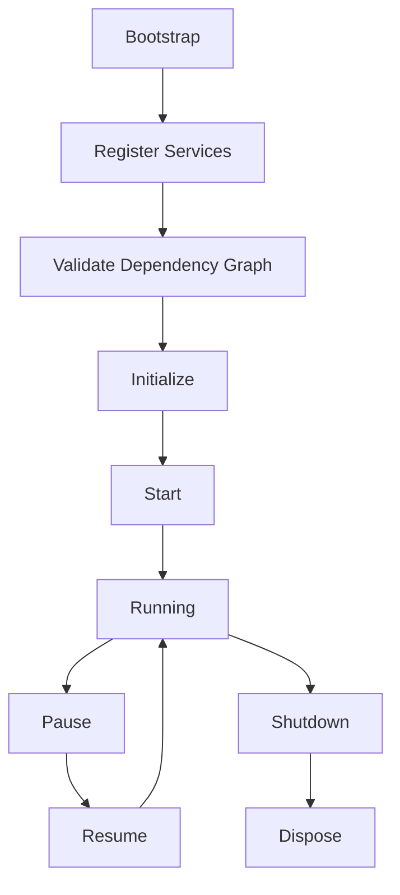

## Service States

Services move through these states:

* `Registered`
* `Initializing`
* `Initialized`
* `Starting`
* `Running`
* `Paused`
* `ShuttingDown`
* `Disposed`
* `Failed`

Invalid transitions throw explicit exceptions. Failures put the service in `Failed` and prevent direct dependents from starting.

## Startup Order

Startup order is dependency-aware first, then priority-aware. Current priorities:

| Priority | Service |
| --- | --- |
| 10 | `IConfigurationService` |
| 15 | `IDataRegistry` |
| 20 | `IConfigService` |
| 30 | `ITimeService` |
| 30 | `IRandomService` |
| 40 | `IEventBus` |
| 45 | `ISimulationScheduler` |
| 50 | `ISaveService` |
| 60 | `IAudioService` |
| 70 | `ISceneService` |
| 90 | `ISimulationEngine` |

Shutdown runs in reverse startup order.

## Dependencies

Services expose dependencies through `IGameService.Dependencies`. The orchestrator validates:

* missing dependencies;
* circular dependencies;
* failed dependencies before startup.

No reflection is used during `Tick`, `FixedTick`, or `LateTick`. The orchestrator keeps precomputed running service lists.

## Registered Services

* `ConfigurationService`
* `DataRegistry`
* `ConfigService`
* `UnityTimeService`
* `UnityRandomService`
* `EventBus`
* `SimulationScheduler`
* `SaveEngine`
* `NullAudioService`
* `UnitySceneService`
* `SimulationEngine`

## Event Bus

`IEventBus` is the single entry point for typed event communication. Systems publish strongly typed events and receive an `EventSubscription` when subscribing. Disposing the subscription releases the handler.

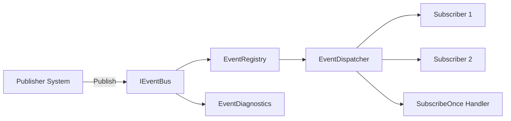

Supported categories are represented by marker interfaces:

* `IGameplayEvent`
* `IHiveEvent`
* `IBeeEvent`
* `IBuildingEvent`
* `IResourceEvent`
* `ICombatEvent`
* `IUIEvent`
* `ISaveEvent`
* `INetworkEvent`
* `IAnalyticsEvent`

Diagnostics track total published events, subscriber counts, average dispatch ticks, and the most frequent event types.

## Simulation Time Engine

`ITimeService` is the official time source for modular gameplay systems. `BeeKingdomCompositionRoot` forwards Unity frame deltas into `UnityTimeService`, then gameplay consumes simulation time through the service API and typed events instead of reading `UnityEngine.Time` directly.

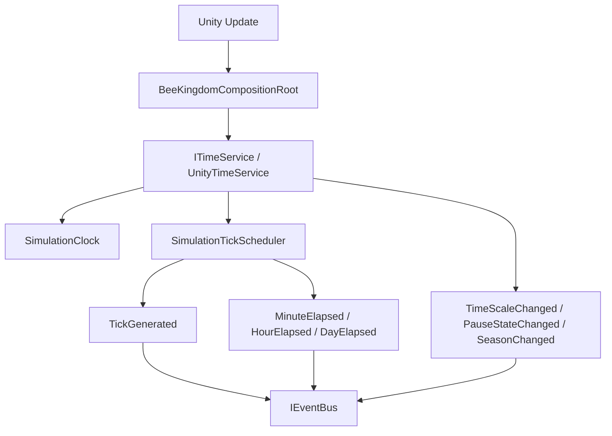

The engine supports frame ticks, 10Hz, 5Hz, 1Hz, simulation minute, simulation hour, and simulation day events. It also exposes pause/resume, simulation acceleration, calendar state, diagnostics, and capped offline time calculation.

The legacy prototype under `Assets/_Project` still keeps a few explicit `UnityEngine.Time` reads while it is being migrated. New Bee Kingdom systems should depend on `ITimeService`.

## Simulation Scheduler

`ISimulationScheduler` executes registered `ISimulationSystem` instances in a deterministic pipeline. It subscribes to `TickGenerated` events from the Time Engine and executes the simulation pipeline on `EveryFrame` simulation ticks.

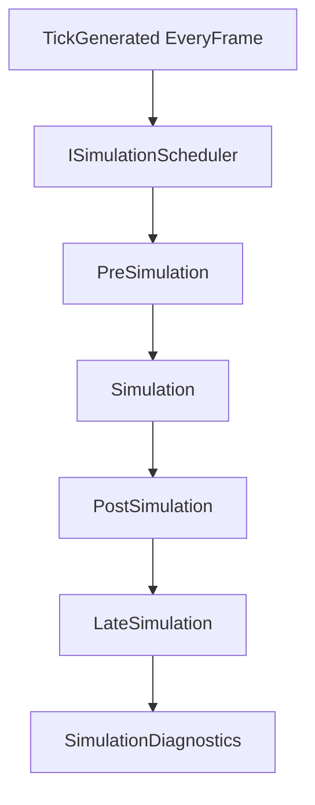

Systems declare a `SimulationPhase`, numeric `Priority`, and optional `RunsAfter` / `RunsBefore` dependencies. The scheduler rebuilds the execution order only when systems are registered, removed, enabled, or disabled. Runtime execution uses a precomputed order and does not require MonoBehaviours or reflection.

Current target phase responsibilities:

| Phase | Intended systems |
| --- | --- |
| `PreSimulation` | input adaptation, pending commands, validation |
| `Simulation` | population, resources, buildings, research, world, combat, AI |
| `PostSimulation` | derived state, notifications, consistency checks |
| `LateSimulation` | deferred cleanup, save hooks, analytics hooks |

## Save Engine

`ISaveService` is the official persistence boundary. New systems must create or consume `SaveSnapshot` data through this service instead of writing directly to disk or PlayerPrefs.

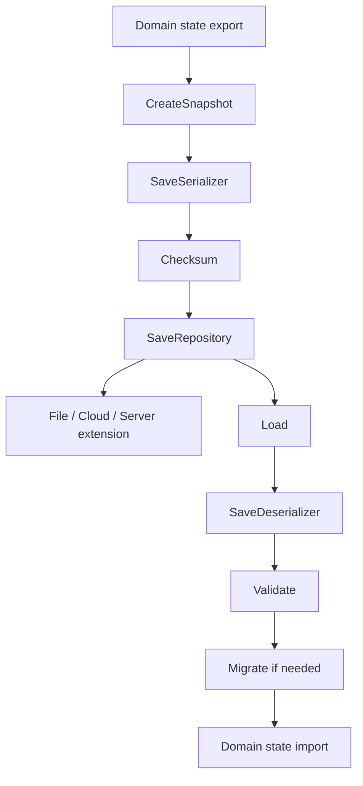

Saves are versioned and contain `SaveVersion`, `GameVersion`, `CreatedAtUtc`, `LastModifiedUtc`, `Checksum`, and payload. The current repository is file-based and rooted under `Application.persistentDataPath/Saves` by the composition root. The core save engine itself has no Unity dependency.

Extension points:

* `SaveRepository` for file, cloud, server, or encrypted storage.
* `SaveMigrationManager` for save-version upgrades.
* `SaveSerializer` / `SaveDeserializer` for future compression or encryption wrappers.
* `SaveDiagnostics` for save, load, auto-save, validation, migration, and incremental-save telemetry.

## Data Registry

`IDataRegistry` is the official read-only access point for game definitions such as bees, buildings, resources, research, flowers, regions, weather, and seasons. Systems should query the registry instead of loading configuration assets directly.

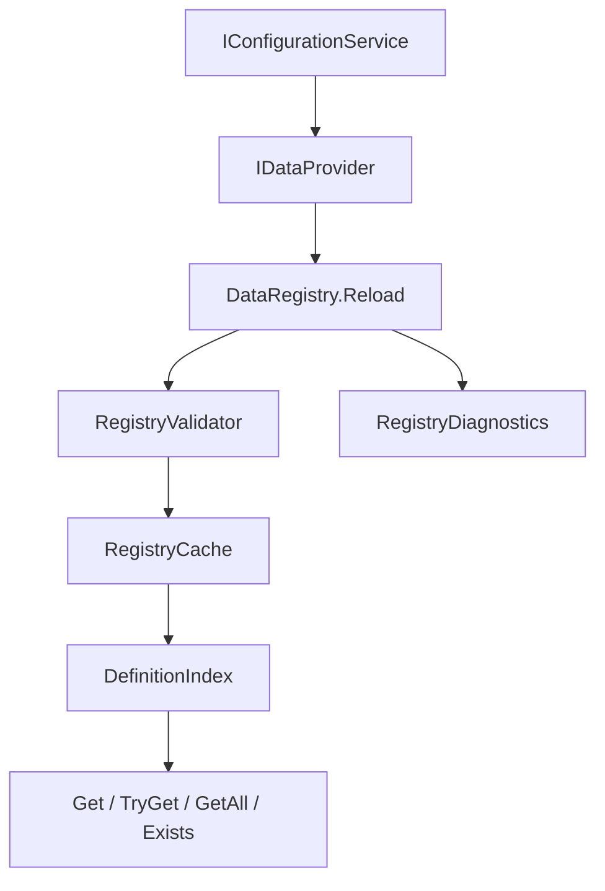

Lookups are indexed by definition type and identifier for O(1) access. The registry validates duplicate ids, missing references, circular dependencies, orphan definitions, and invalid identifiers during reload. After a successful load, consumers receive read-only definition lists from the cache.

The registry is prepared for downloadable content and Addressables through `IDataProvider`; the current provider adapts the existing Configuration System.

## Simulation Engine Core

`ISimulationEngine` is the central coordinator for the simulation runtime. It assembles the Time Engine, Simulation Scheduler, Event Bus, Save Engine, Data Registry, and service registry into a single `SimulationContext`.

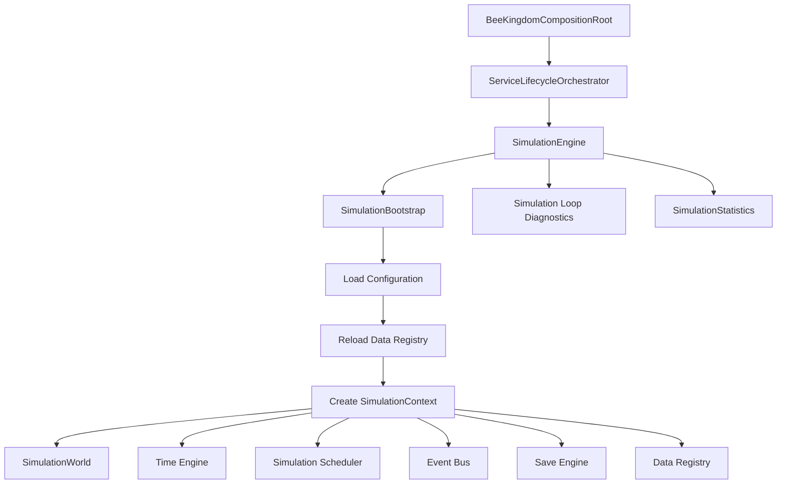

The engine contains no gameplay rules. Its role is to provide one operational context and lifecycle surface for future systems such as Hive, Resources, Population, AI, World, and Combat. Current simulation ticks update engine diagnostics and world revision after the lower-level services have processed their lifecycle ticks.

## Hive Domain

`HiveAggregate` is the first main gameplay aggregate. It owns the local hive identity, owner, queen, bee population, buildings, inventories, capacity limits, expansion map, statistics, validation, and serialization snapshot.

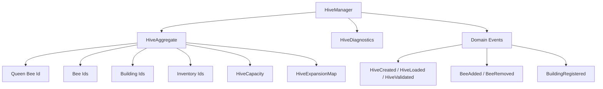

Hive invariants:

* a hive has exactly one queen;
* the queen belongs to the hive population;
* a bee can belong to only one hive;
* a building can belong to only one hive;
* population, buildings, and inventories cannot exceed capacity.

`HiveManager` implements `ISimulationSystem` so it can be registered into the simulation scheduler when the gameplay composition layer is introduced. It currently contains no harvesting, combat, graphics, or AI logic.

## Queen System

`QueenAggregate` models the biological core of a hive: identity, hive ownership, age, health, energy, fertility, level, experience, egg production, configurable bonuses, and queen state.

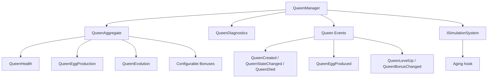

Queen states are validated through explicit transitions: `Egg`, `Larva`, `Pupa`, `VirginQueen`, `MatedQueen`, `ActiveQueen`, `Swarming`, `Injured`, and `Dead`. Egg production is configurable through `QueenEggProduction` and accepts health, energy, fertility, season, research, level, and bonus modifiers. Bonus values are stored by `QueenBonusType`; no concrete bonus amount is hard-coded in gameplay logic.

## Bee Lifecycle

`BeeLifecycleManager` models each bee as a simulated living entity. It owns bee lifecycle records, applies configurable development and mortality rules, publishes lifecycle events, and implements `ISimulationSystem` for scheduler integration.

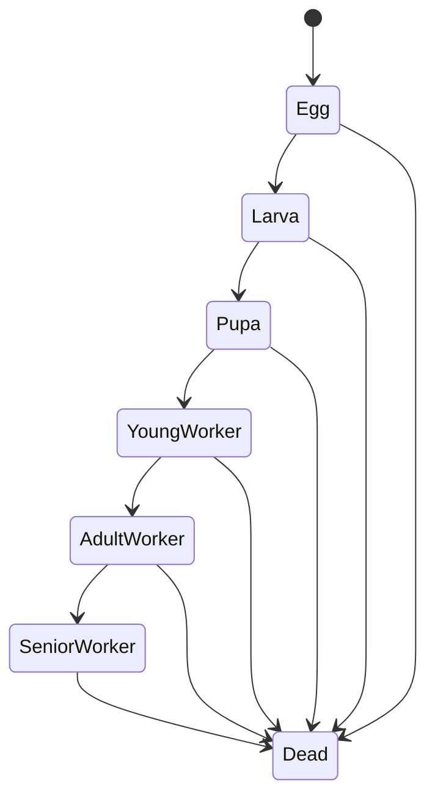

Each bee tracks `BeeId`, `HiveId`, birth time, age, biological age, lifecycle stage, lifecycle role, health, energy, experience, genetics id, and alive/dead state. Development is controlled by `BeeDevelopmentProfile`; mortality by `BeeMortalityProfile`; aging modifiers are passed into `AdvanceLifecycle` for season, queen, research, and future events.

The lifecycle system does not assign tasks, move bees, run AI, harvest resources, or resolve combat. Those responsibilities start in later bricks.

## Task System

`TaskManager` manages colony work items without direct player control of individual bees. It provides task creation, priority scoring, reservation, assignment, completion, cancellation, diagnostics, and events.

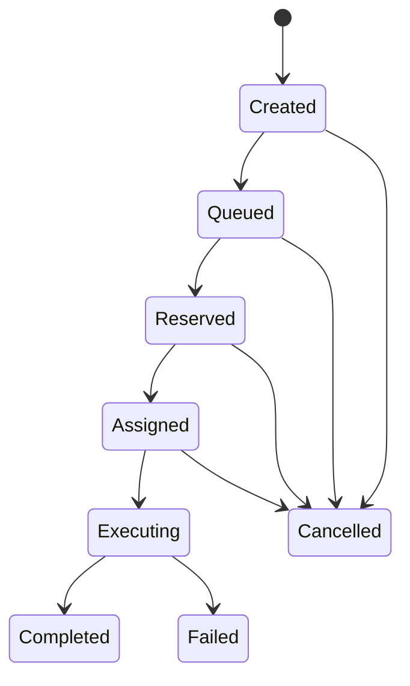

`TaskAllocator` selects candidates using role, energy, health, experience, and availability. Distance and pathing are intentionally deferred to AI/navigation work. The task system runs after Bee Lifecycle in `PostSimulation`, preparing integration points for Population Manager and Bee AI.

## Bee AI Framework

Bee AI executes tasks assigned by the colony. A bee brain never chooses strategic goals; it receives a task, validates local preconditions, runs a lightweight behavior, reports completion/interruption, then waits.

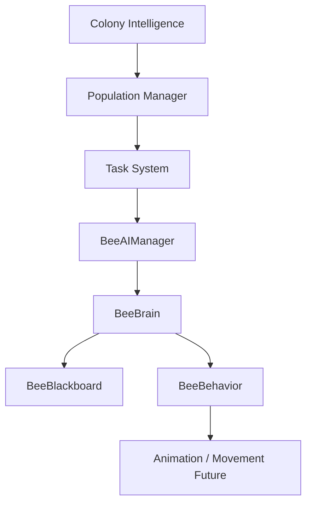

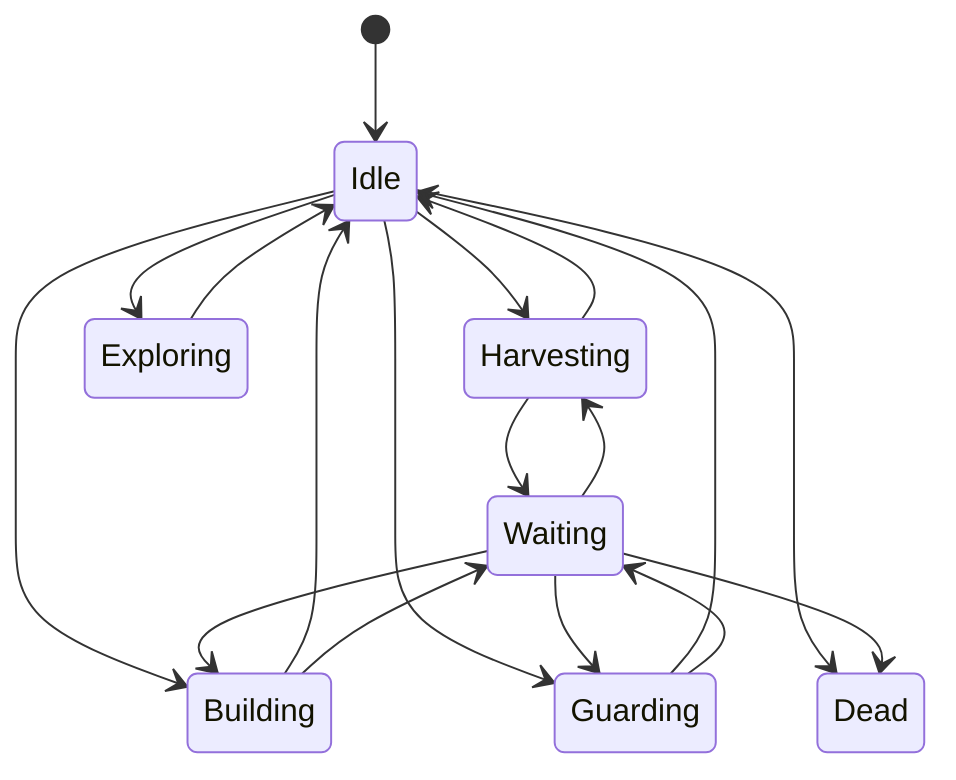

`BeeBlackboard` remains local and lightweight: current task, target, state, energy, health, reservation state, and local context only. `BeeAIManager` supports staggered updates through `updatesPerTick`, preparing the path toward 50,000+ simulated bees.

## Resource Flow System

`ResourceFlowManager` is the official boundary for production, reservation, storage, transfer, consumption, and transaction history. Systems should not mutate inventories or storage directly.

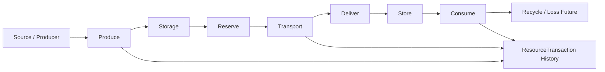

Supported resources: `Nectar`, `Pollen`, `Water`, `Wax`, `Honey`, `RoyalJelly`, and `Propolis`. `ResourceStorage` tracks amount, reservation, and capacity per resource type with O(1) lookups. Reservations prevent double consumption. Transaction history is bounded by a configurable limit.

## Hive Inventory

`HiveInventoryManager` models physical storage cells inside the hive. Resources are deposited into and withdrawn from finite cells instead of a global infinite counter.

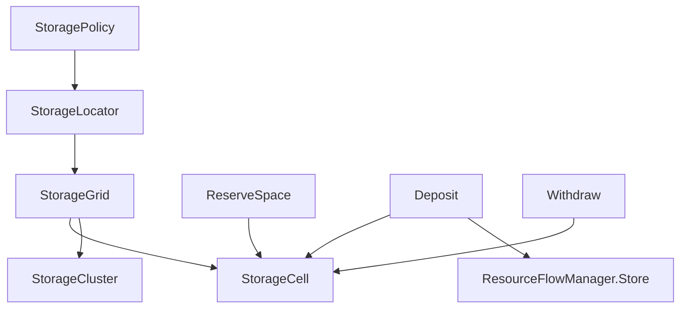

Cells track position, resource type, capacity, current amount, reserved amount, accessibility, and state: `Empty`, `Filling`, `Full`, `Reserved`, `Locked`, `Damaged`. Clusters group compatible nearby cells by resource type. Locator policies include `Nearest`, `Balanced`, `Priority`, `Specialized`, and `FutureAI`.

## Organic Hive Growth

`HiveGrowthManager` models the hive as an organic topology made of chambers, galleries through chamber connections, and honeycomb cells. It exposes planning, construction, connection, upgrade, validation, and layout snapshot APIs without Unity or rendering dependencies.

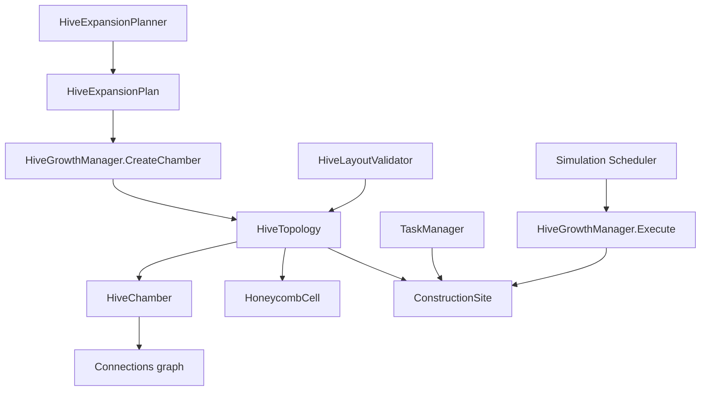

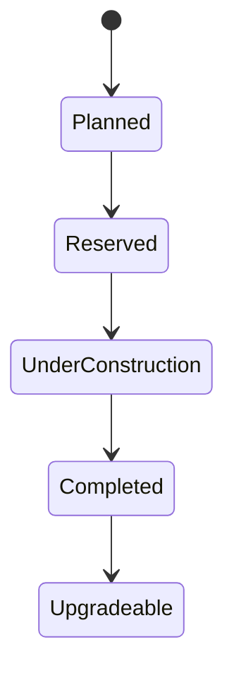

Expansion decisions are represented by `HiveExpansionRequest`: population, wax availability, temperature, research ids, and player approval. The initial planner uses conservative defaults while keeping the API ready for configuration data and research modifiers. Construction sites publish `ChamberPlanned`, `ChamberConstructionStarted`, `ChamberCompleted`, `HiveExpanded`, and `TopologyChanged`.

Topology validation performs graph reachability from the entrance chamber when available, detects isolated chambers, inaccessible chambers, and capacity overflows. `HiveTopologySnapshot` exposes layout data for save serialization and future visual or navigation systems. Hive Inventory integration is prepared through specialized honeycomb cell functions such as honey storage, pollen storage, brood, royal, wax production, defense, entrance, and transit.

## First Playable Hive

`PlayableHiveBootstrap` assembles the foundational systems into the first playable colony loop. It creates starter profiles, initializes a hive, queen, population, resources, inventory cells, organic chambers, tasks, AI brains, diagnostics, and a colony controller.

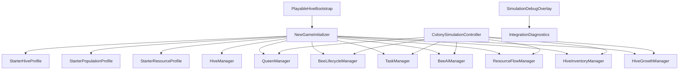

The first playable loop validates the superorganism concept: the queen produces eggs, new bees are created through lifecycle APIs, colony tasks are assigned to AI brains, resources are produced and stored through resource/inventory APIs, and organic chambers can grow through construction sites. `SimulationDebugOverlay` is an optional development overlay showing population, resources, active tasks, simulated time, simulation FPS, events per second, and average tick duration.

`Gameplay` intentionally depends on domain modules but not on the concrete `Services` assembly. This prevents assembly cycles and keeps service ownership in the composition layer.

## World Generation Framework

`WorldManager` introduces the deterministic world framework. It creates, loads, streams, validates, and exposes regions generated from a `WorldSeed` and a `WorldGenerationProfile`.

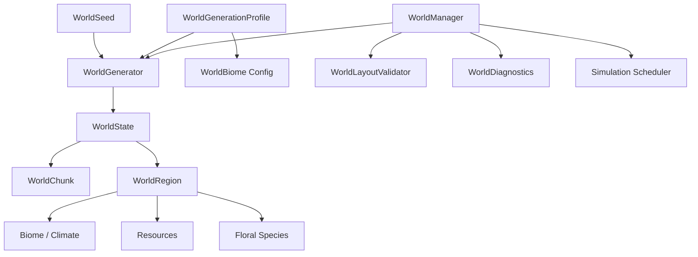

Generation pipeline:

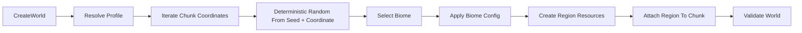

The same seed and profile produce the same regions, biomes, richness, difficulty, weather, resources, and floral species. The core contains no rendering or Unity-specific logic. `WorldManager` implements `ISimulationSystem`, preparing future integration with seasons, weather, flowers, exploration, and AI colonies.

## Hex World Grid

`HexGrid` maps generated world regions onto deterministic axial hex coordinates. It provides cell lookup, six-direction neighbor traversal, chunk mapping, streaming flags, path movement costs, region indexing, and serialization snapshots without rendering.

```mermaid
flowchart TD
    A["WorldState"] --> B["HexGrid.FromWorld"]
    B --> C["HexCell"]
    C --> D["HexCoordinates Q/R/S"]
    C --> E["WorldChunkCoordinate"]
    B --> F["HexRegionIndex"]
    B --> G["HexPathIndex"]
    B --> H["HexGridSnapshot"]
    I["LoadChunk / UnloadChunk"] --> C
```

`HexCoordinates` uses axial `Q/R` with derived cube `S = -Q - R`, enabling stable distance and neighbor math. Chunk mapping uses floor division so negative coordinates stream correctly. Future systems can use `HexPathIndex` for navigation and `HexRegionIndex` for exploration, flowers, water, threats, and colony activity.

## Flower Ecosystem

`FlowerManager` models living flower patches on world regions and hex cells. Species are data objects containing nectar/pollen capacity, bloom cycle, and pollination rules.

```mermaid
stateDiagram-v2
    [*] --> Seedling
    Seedling --> Growing
    Growing --> Blooming
    Blooming --> Faded
    Faded --> Dormant
    Dormant --> Seedling
```

```mermaid
flowchart TD
    A["WorldRegion Floral Species"] --> B["FlowerManager.SeedFromRegion"]
    C["HexRegionIndex"] --> B
    B --> D["FlowerPatch"]
    E["FlowerSpecies"] --> D
    F["BloomCycle"] --> D
    G["PollinationRules"] --> D
    H["Season + Weather"] --> I["Regeneration"]
    I --> D
    D --> J["FlowerBloomed / FlowerDepleted"]
```

Blooming patches regenerate nectar and pollen according to season and weather modifiers. Harvesting can deplete a patch, while the bloom cycle later regenerates it. The system has no rendering logic and runs as an `ISimulationSystem`.

## Water And Hydration

`WaterManager` models water sources, hydration demand, seasonal recharge, weather effects, and water transport into colony storage through `ResourceFlowManager`.

```mermaid
flowchart TD
    A["WorldRegion water resource"] --> B["WaterManager.SeedFromRegion"]
    C["HexRegionIndex"] --> B
    B --> D["WaterSource"]
    E["Season + Weather"] --> F["Recharge"]
    F --> D
    G["HydrationDemand"] --> H["DemandForSeconds"]
    I["CollectWater"] --> D
    I --> J["ResourceFlowManager.Produce Water"]
    I --> K["WaterCollected / WaterSourceDepleted"]
```

Water sources carry source type, quality, capacity, available amount, and recharge rate. Seasons and weather influence availability. Hydration demand is computed from population and daily water needs. The system lives in `BeeKingdom.World` and depends on `BeeKingdom.Economy` only for official Resource Flow integration.

## Seasons And Weather

`SeasonManager` and `WeatherManager` centralize environmental state for world systems. Seasons advance by configured duration and publish the existing Time Engine `SeasonChanged` event. Weather changes deterministically from a `WorldSeed`, `WeatherProfile`, and configured weather duration.

```mermaid
flowchart TD
    A["SeasonManager"] --> B["SimulationSeason"]
    C["WeatherManager"] --> D["WorldWeather"]
    E["WeatherProfile"] --> C
    F["ClimateRules"] --> C
    B --> G["Production / Consumption Modifiers"]
    D --> H["Movement Modifier"]
    D --> I["Flower / Water Environment"]
```

`ClimateRules` exposes modifiers for production, movement, and consumption. Flower and water systems can receive season/weather through their existing environment APIs, and later systems can consume the same rules without duplicating climate logic.

## Natural Resource Regeneration

`RegenerationManager` models natural resource nodes that regrow over time according to lifecycle rules and ecological balance.

```mermaid
stateDiagram-v2
    [*] --> Growing
    Growing --> Available
    Available --> Depleted
    Depleted --> Growing
    Growing --> Dormant
    Dormant --> Growing
```

```mermaid
flowchart TD
    A["WorldRegion Resources"] --> B["RegenerationManager.SeedFromRegion"]
    C["HexRegionIndex"] --> B
    B --> D["NaturalResourceNode"]
    E["ResourceNodeLifecycle"] --> D
    F["EcologicalBalance"] --> G["Pollination * Climate * Biome"]
    G --> D
    H["Harvest"] --> I["NaturalResourceDepleted"]
    D --> J["NaturalResourceRegenerated"]
```

Nodes currently support world resources mapped to economy resource types such as nectar, pollen, and water. Ecological balance prepares future AI colonies, pollination effects, biome pressure, and climate disruptions.

## Gameplay Ability Core

`GameplayAbilityManager` is a generic ability framework for intentional game actions. It does not know about bees, queens, flowers, weather, combat, or research; those systems depend on abilities, not the reverse.

```mermaid
flowchart TD
    A["GameplayAbilityDefinition"] --> B["GameplayAbilityRegistry"]
    C["GameplayAbilityContext"] --> D["GameplayAbilityFactory"]
    B --> E["GameplayAbilityManager"]
    D --> F["GameplayAbilityInstance"]
    E --> F
    F --> G["GameplayAbilityHandle"]
    F --> H["GameplayAbilityResult"]
    E --> I["GameplayAbilityDiagnostics"]
    E --> J["Ability Events"]
    K["GameplayAbilityTag"] --> A
```

```mermaid
stateDiagram-v2
    [*] --> Registered
    Registered --> Available
    Available --> Requested
    Requested --> Validated
    Validated --> Activated
    Activated --> Executing
    Executing --> Completed
    Requested --> Cancelled
    Validated --> Cancelled
    Activated --> Interrupted
    Executing --> Failed
```

Definitions are data-only: id, display name, category, gameplay tags, conditions, priority, placeholder costs, future effect ids, and LiveOps metadata. Contexts are immutable execution inputs containing source, targets, world, simulation time, seed, zone, alliance, player, activation source, and parameters. Handles are stable and deterministic per manager activation order.

## Gameplay Effects Core

`GameplayEffectManager` is the generic framework for durable or temporary world state changes triggered by abilities, LiveOps, backend events, weather, seasons, research, buildings, territory, or rare world objects.

```mermaid
flowchart TD
    A["GameplayEffectDefinition"] --> B["GameplayEffectRegistry"]
    C["GameplayEffectContext"] --> D["GameplayEffectFactory"]
    B --> E["GameplayEffectManager"]
    D --> F["GameplayEffectInstance"]
    F --> G["GameplayEffectHandle"]
    F --> H["GameplayEffectState"]
    E --> I["GameplayEffectDiagnostics"]
    E --> J["Effect Events"]
    K["Modifier Ids (BEE-034)"] --> A
```

```mermaid
stateDiagram-v2
    [*] --> Registered
    Registered --> Pending
    Pending --> Applied
    Applied --> Active
    Active --> Refreshing
    Refreshing --> Active
    Active --> Expired
    Expired --> Removed
    Active --> Suspended
    Suspended --> Active
    Active --> Removed
    Active --> Failed
```

Effect definitions are data-only and reference future modifier ids without calculating final values. Active instances can be snapshotted for save/restore. The core is independent from concrete gameplay and contains no Unity dependency.

## Gameplay Modifier Engine

`GameplayModifierEngine` calculates final gameplay values from data-driven modifiers. It is independent from domain systems and is designed to be reused by effects, abilities, attributes, weather, seasons, LiveOps, alliances, combat, construction, queen bonuses, and AI.

```mermaid
flowchart LR
    A["Base Value"] --> B["Add / Subtract"]
    B --> C["Multiply / Divide / Curve"]
    C --> D["Formula"]
    D --> E["Override"]
    E --> F["Clamp / Minimum / Maximum"]
    F --> G["Final Value"]
```

```mermaid
flowchart TD
    A["GameplayModifierDefinition"] --> B["GameplayModifierInstance"]
    B --> C["ModifierStackResolver"]
    C --> D["ModifierAggregator"]
    E["ModifierEvaluationContext"] --> D
    F["FormulaEvaluator"] --> D
    D --> G["GameplayModifierEngine"]
    G --> H["Modifier Diagnostics"]
    G --> I["Modifier Events"]
```

Supported operations are `Add`, `Subtract`, `Multiply`, `Divide`, `Override`, `Clamp`, `Minimum`, `Maximum`, `Curve`, and `Formula`. Supported stacking rules include additive, multiplicative, highest-only, lowest-only, replace, refresh/extend duration placeholders, duplicate ignoring, and exclusive groups. Conditions are evaluated from gameplay tags and context parameters with AND/OR/NOT support.

## Gameplay Attributes Framework

`GameplayAttributeManager` is the central state store for gameplay values. Systems should read final values through attributes and delegate recalculation to `GameplayModifierEngine`.

```mermaid
flowchart TD
    A["GameplayAttributeDefinition"] --> B["GameplayAttributeRegistry"]
    B --> C["GameplayAttributeSet"]
    C --> D["GameplayAttributeInstance"]
    E["GameplayModifierEngine"] --> F["Recalculate"]
    F --> D
    D --> G["GameplayAttributeSnapshot"]
    H["Abilities / Effects / Simulation"] --> C
```

```mermaid
stateDiagram-v2
    [*] --> Registered
    Registered --> Initialized
    Initialized --> Active
    Active --> Modified
    Modified --> Recalculated
    Recalculated --> Serialized
    Serialized --> Restored
```

Attribute definitions are data-driven and include category, type, default value, min/max, visibility, network sync, persistence, and precision. Attribute sets are owner-scoped and support specialized sets such as Queen, Hive, Bee, World, and Alliance attributes.

## Gameplay Workflow Engine

`GameplayWorkflowManager` is the central orchestration layer for gameplay actions. Abilities should enter the workflow engine before execution, then progress through effects, modifiers, attributes, and simulation-facing state.

```mermaid
flowchart TD
    A["Gameplay Ability"] --> B["GameplayWorkflowManager"]
    B --> C["WorkflowValidator"]
    B --> D["WorkflowScheduler"]
    D --> E["WorkflowQueue"]
    B --> F["WorkflowReservationService"]
    F --> G["WorkflowExecutor"]
    G --> H["Gameplay Effects"]
    H --> I["Modifier Engine"]
    I --> J["Attribute Framework"]
    J --> K["Simulation Engine"]
```

```mermaid
stateDiagram-v2
    [*] --> Requested
    Requested --> Validated
    Validated --> Queued
    Queued --> Reserved
    Reserved --> Executing
    Executing --> ApplyingEffects
    ApplyingEffects --> UpdatingAttributes
    UpdatingAttributes --> Completed
    Queued --> Cancelled
    Executing --> Interrupted
    Interrupted --> Retrying
    Retrying --> Queued
    Queued --> Suspended
    Suspended --> Queued
    Reserved --> Failed
```

The scheduler is deterministic and supports priority tiers from Immediate to Background across Player, BeeAI, World, Simulation, Backend, and LiveOps queues. Reservations are generic string resources for future resource, cell, path, target, and building locks.

## Gameplay Integration Layer

`GameplayIntegrationManager` provides weakly-coupled bridges between the gameplay frameworks and concrete domains such as Simulation, Bee AI, World, Hive, Backend, and LiveOps.

```mermaid
flowchart TD
    A["GameplayIntegrationManager"] --> B["IntegrationRegistry"]
    B --> C["GameplayBridge"]
    C --> D["Domain"]
    C --> E["Capabilities"]
    F["Ability / Workflow / Effect"] --> A
    A --> G["Route by capability"]
```

Core does not reference domain assemblies for integration. Each domain registers a `GameplayBridge` with capability strings, and the integration manager routes requests deterministically by capability.

## Simulation Entity Framework

`SimulationEntity` is the shared lightweight identity model for simulated objects such as bees, flowers, buildings, resources, and future world actors.

```mermaid
flowchart TD
    A["EntityFactory"] --> B["SimulationEntity"]
    B --> C["EntityId"]
    B --> D["EntityLifecycle"]
    E["EntityRegistry"] --> B
```

Entities expose stable ids, type, tags, and a generic lifecycle: Created, Active, Suspended, Destroyed. Domain-specific state remains in domain systems; the entity framework provides common identity and registration only.

## Simulation Tick Engine

`SimulationTickEngine` is a pure deterministic tick calculator for fixed ticks, variable ticks, time scaling, fast-forward, pause, and background simulation scenarios.

```mermaid
flowchart TD
    A["Delta Seconds"] --> B["Time Scale"]
    B --> C{"Paused?"}
    C -->|"No"| D{"Tick Mode"}
    D --> E["Variable Tick"]
    D --> F["Fixed / Fast Forward Accumulator"]
    E --> G["TickIndex + TotalSeconds"]
    F --> G
```

This layer complements the Unity-facing Time Engine and prepares backend authoritative simulation and accelerated offline progress.

## Simulation Time System

`SimulationTimeSystem` is the canonical deterministic clock for backend, LiveOps, and offline simulation contexts. It converts total simulation seconds into hour, day, season, and year while supporting acceleration, pause, and LiveOps calendar windows.

```mermaid
flowchart TD
    A["Total Seconds"] --> B["Time Scale / Pause"]
    B --> C["SimulationTimePoint"]
    C --> D["Hour / Minute"]
    C --> E["Day Of Season"]
    C --> F["Season"]
    C --> G["Year"]
    H["LiveOpsCalendarWindow"] --> A
```

This system does not replace Unity-facing runtime time services; it provides one deterministic source suitable for backend-authoritative and replayable contexts.

## Gameplay Event Scheduler

`GameplayEventScheduler` schedules delayed, periodic, calendar, and LiveOps events against canonical simulation seconds.

```mermaid
flowchart TD
    A["Schedule Event"] --> B["Due Seconds"]
    C["Tick Now Seconds"] --> D["Find Due Events"]
    D --> E["Emit Due List"]
    E --> F["Cancel one-shot"]
    E --> G["Reschedule periodic"]
    H["Snapshot"] --> I["Restore after restart"]
```

The scheduler is deterministic and can snapshot active scheduled events for persistence and restart recovery.

## Resource Flow Engine

`ResourceFlowEngine` is a deterministic route-based layer above `ResourceFlowManager`. It registers data-driven routes and executes bounded transfer requests through the existing resource flow APIs.

```mermaid
flowchart TD
    A["ResourceFlowRoute"] --> B["ResourceFlowEngine"]
    C["ResourceFlowRequest"] --> B
    B --> D["ResourceFlowManager.Transfer"]
    D --> E["Transaction History"]
```

This preserves the existing economy foundation while adding backend/LiveOps friendly route orchestration.

## Colony Traffic Manager

`ColonyTrafficManager` manages deterministic internal colony routes and their active capacity reservations.

```mermaid
flowchart TD
    A["ColonyTrafficRoute"] --> B["ColonyTrafficManager"]
    C["Reserve"] --> B
    D["Release"] --> B
    B --> E["ReservationCount"]
    B --> F["Route Lookup"]
```

The manager is intentionally pure C# and route-based so future bee movement, chamber congestion, and backend-authoritative simulations can share the same traffic rules without depending on Unity scene state.

## Simulation Statistics Engine

`SimulationStatisticsEngine` records named simulation metrics and aggregates them deterministically for diagnostics, backend validation, LiveOps dashboards, and replay comparison.

```mermaid
flowchart TD
    A["SimulationMetricDefinition"] --> B["SimulationStatisticsEngine"]
    C["RecordSample"] --> B
    B --> D["Aggregate Value"]
    B --> E["SimulationStatisticsSnapshot"]
    B --> F["Statistics Diagnostics"]
```

Metrics are data-driven by identifier and aggregation mode: last, sum, min, max, and average. Snapshots are sorted by metric id to make persisted statistics stable across runs.

## Diagnostics and Debug Framework

`BeeDiagnosticsManager` provides structured, bounded, and filterable diagnostics for engine systems.

```mermaid
flowchart TD
    A["Log / Record"] --> B["BeeDiagnosticsManager"]
    C["Minimum Level"] --> B
    D["Muted Categories"] --> B
    B --> E["BeeDiagnosticEvent Buffer"]
    B --> F["BeeDiagnosticsSnapshot"]
    B --> G["BeeDiagnosticsCounters"]
```

The framework implements `IBeeLogger`, so systems can use the same interface for Unity console output or in-memory deterministic diagnostics. Categories and severity filters keep debug output controllable for mobile builds and backend simulation.

## Simulation Replay System

`SimulationReplaySystem` records deterministic simulation frames and compares a later execution against a reference recording.

```mermaid
flowchart TD
    A["Start Recording"] --> B["SimulationReplaySystem"]
    C["Replay Frame"] --> B
    B --> D["SimulationReplayRecording"]
    D --> E["Compare Expected / Actual"]
    E --> F["Replay Comparison"]
```

Replay frames store tick index, simulation seconds, delta seconds, input hash, and state hash. This keeps the system backend-friendly and allows future replay validation without serializing full gameplay state every tick.

## Building Framework

`BuildingManager` is the foundation for all future buildings, chambers, and colony structures.

```mermaid
flowchart TD
    A["BuildingDefinition"] --> B["BuildingRegistry"]
    B --> C["BuildingFactory"]
    C --> D["BuildingInstance"]
    D --> E["BuildingSnapshot"]
    D --> F["BuildingEvents"]
```

Definitions are data-only and registered through the framework. Instances carry entity id, definition id, position, rotation, lifecycle state, health, progress, owner hive, attributes, and construction workflow id. No concrete building behavior is introduced in this layer.

## Building Placement System

`BuildingPlacementManager` is the required entry point for reserving and confirming building space.

```mermaid
flowchart TD
    A["PlacementRequest"] --> B["PlacementValidator"]
    B --> C{"Valid?"}
    C -->|"Yes"| D["PlacementReservation"]
    D --> E["ConfirmPlacement"]
    E --> F["Occupied Grid Cells"]
    C -->|"No"| G["PlacementRejected"]
```

Placement validates definition existence, bounds, depth, connection constraints, collisions, reservations, previews, expiration, cancellation, and deterministic location queries. This prepares construction workflows without allowing direct placement bypasses.

## Construction Workflow Engine

`ConstructionWorkflowManager` orchestrates construction as deterministic data-driven phases.

```mermaid
flowchart TD
    A["ConstructionWorkflowDefinition"] --> B["ConstructionWorkflowInstance"]
    B --> C["Waiting Resources"]
    C --> D["Waiting Builders"]
    D --> E["Under Construction"]
    E --> F["Inspection"]
    F --> G["Operational"]
```

Each workflow references a building id and a list of phases with required work and resource cost data. The engine controls pause, resume, cancellation, failure, phase advancement, and completion without relying on scene objects.

## Construction Queue System

`ConstructionQueueManager` is the central planning layer for construction requests before they enter the workflow engine.

```mermaid
flowchart TD
    A["EnqueueConstruction"] --> B["ConstructionQueue"]
    C["Priority Resolver"] --> B
    D["Dependencies"] --> B
    B --> E["Ready Item"]
    E --> F["ConstructionWorkflowManager"]
```

Queue items track priority, dependencies, state, urgency, workflow id, and building entity id. Ordering is deterministic and stable by priority score and insertion sequence, while blocked dependencies remain queued until their prerequisites complete.

## Construction Validation Engine

`ConstructionValidationManager` is the source of truth for construction validity before queueing or workflow execution.

```mermaid
flowchart TD
    A["ValidationContext"] --> B["ConstructionValidationEngine"]
    C["ValidationRule"] --> B
    B --> D["ValidationResult"]
    D --> E["Validation Issues"]
```

Rules are registered data objects grouped by placement, dependency, technology, resource, population, and world categories. Results preserve detailed causes and deterministic rule order.

## Chamber Framework

`ChamberManager` is the foundation for all specialized hive chambers.

```mermaid
flowchart TD
    A["ChamberDefinition"] --> B["ChamberRegistry"]
    B --> C["ChamberFactory"]
    C --> D["ChamberInstance"]
    D --> E["Capacity / Occupancy"]
    D --> F["ChamberSnapshot"]
```

Chambers are data-defined organs of the colony with category, capacity, supported activities, accepted resources, lifecycle state, health, and attribute set. The framework does not introduce hard-coded chamber behavior.

## Chamber Categories

`ChamberCategoryManager` classifies chambers through data-driven category definitions.

```mermaid
flowchart TD
    A["ChamberCategoryDefinition"] --> B["ChamberCategoryRegistry"]
    B --> C["ChamberCategoryManager"]
    C --> D["AssignCategory"]
    C --> E["Validate Compatibility"]
    C --> F["Query Compatible Categories"]
```

Categories describe allowed activities, accepted resources, caste permissions, compatibility, incompatible neighbors, and construction/logistics/maintenance/energy priorities. A base category catalog is available as a seed and can be replaced by Data Registry content.

## Chamber Connection System

`ChamberConnectionManager` owns the physical graph between hive chambers.

```mermaid
flowchart TD
    A["ChamberConnectionDefinition"] --> B["ConnectionValidator"]
    B --> C["ChamberConnectionManager"]
    C --> D["ChamberGraph"]
    D --> E["Query Neighbours"]
    D --> F["Find Shortest Path"]
```

Connections represent corridors, direct links, vertical links, surface access, restricted paths, one-way paths, and temporary links. The graph is the single reference for future movement, logistics, traffic, and resource flow inside the hive.

## Internal Corridor Engine

`CorridorManager` manages operational corridor instances on top of the chamber connection graph.

```mermaid
flowchart TD
    A["CorridorDefinition"] --> B["CorridorRegistry"]
    B --> C["CorridorManager"]
    C --> D["ReserveTraversal"]
    D --> E{"Congested?"}
    C --> F["CalculateTravelCost"]
```

Corridors expose capacity, current traffic, maximum traffic, movement speed, congestion factor, traversal cost, blocking, and destruction. Future movement and logistics systems must reserve traversal through this layer.

## Builder AI Integration

`BuilderIntegrationManager` connects construction workflows to assigned builder bees.

```mermaid
flowchart TD
    A["BuilderProfile"] --> B["BuilderAssignmentEngine"]
    B --> C["BuilderReservationManager"]
    C --> D["BuilderWorkSession"]
    D --> E["CalculateWorkContribution"]
    E --> F["ConstructionWorkflowManager"]
```

Builder assignment is deterministic by priority, experience, fatigue, distance, and builder id. Work sessions support assignment, travel, work, interruption, resume, reassignment, completion, release, and collective contribution.

## Resource Delivery Framework

`ResourceDeliveryManager` orchestrates physical resource deliveries to construction sites.

```mermaid
flowchart TD
    A["DeliveryRequest"] --> B["DeliveryOrder"]
    B --> C["DeliveryReservation"]
    C --> D["Transport Assigned"]
    D --> E["DeliveryBatch"]
    E --> F["Validated Delivery"]
```

Deliveries support reservation, transporter assignment, partial batches, delay, cancellation, and deterministic query ordering. Future construction progress should wait for validated deliveries instead of teleporting resources.

## Construction Priority Engine

`ConstructionPriorityManager` is the decision layer for construction execution priorities.

```mermaid
flowchart TD
    A["PriorityContext"] --> B["ConstructionPriorityEngine"]
    C["ConstructionPriorityDefinition"] --> B
    D["PriorityRule"] --> B
    B --> E["PriorityResult"]
```

Priority evaluation combines a configurable base level, weighted rules, overrides, promotions, demotions, and emergency detection. Queue ordering should consume these calculated results rather than making independent priority decisions.

## Building Upgrade Framework

`BuildingUpgradeManager` is the single path for building and chamber upgrades.

```mermaid
flowchart TD
    A["BuildingUpgradeDefinition"] --> B["UpgradeTree"]
    B --> C["ValidateUpgrade"]
    C --> D["StartUpgrade"]
    D --> E["CompleteUpgrade"]
    E --> F["Upgrade History"]
```

Upgrade definitions are data-only, with requirements, target level, exclusivity metadata, and optional Gameplay Effect ids. The manager preserves building identity while tracking level and upgrade history.

## Building Dependency Graph

`BuildingDependencyManager` owns progression dependencies between buildings, chambers, technologies, population, resources, queen level, colony level, categories, world states, and events.

```mermaid
flowchart TD
    A["DependencyNode"] --> B["BuildingDependencyGraph"]
    C["DependencyEdge"] --> B
    B --> D["ValidateDependencies"]
    D --> E["Unlocked / Locked"]
```

Dependencies are data-driven edges with type, priority, optional flag, and validation rule id. The graph detects cycles and provides missing dependency lists plus deterministic locked/unlocked queries.

## Colony Layout Engine

`ColonyLayoutManager` analyzes hive organization without automatically moving structures.

```mermaid
flowchart TD
    A["Chamber / Corridor Counts"] --> B["LayoutScoreCalculator"]
    B --> C["LayoutScore"]
    D["ColonyLayoutAnalyzer"] --> E["Recommendations"]
    C --> F["ColonyLayoutSnapshot"]
    E --> F
```

The layout engine calculates logistics, production, population, expansion, defense, accessibility, and overall colony scores. It detects bottlenecks, manages sectors, emits recommendations, and produces snapshots for AI and player-facing guidance.

## Structural Integrity Engine

`StructuralIntegrityManager` evaluates hive stability, weak zones, support load, and expansion safety.

```mermaid
flowchart TD
    A["StructuralNode"] --> B["StructuralSupportGraph"]
    B --> C["StructuralAnalyzer"]
    C --> D["Integrity Score"]
    C --> E["Weak Zones"]
    E --> F["Reinforcement Recommendations"]
```

The engine never destroys hive sections instantly. It reports warning states, failure risk, weak zones, reinforcement recommendations, and expansion validation results for construction and layout systems.

## Maintenance Framework

`MaintenanceManager` schedules and tracks maintenance for buildings, chambers, and corridors.

```mermaid
flowchart TD
    A["MaintenanceDefinition"] --> B["ScheduleMaintenance"]
    B --> C["MaintenanceTask"]
    C --> D["Start / Complete / Cancel"]
    E["InspectBuilding"] --> F["MaintenanceState"]
```

Maintenance covers cleaning, repair, reinforcement, expansion preparation, inspection, ventilation, resource removal, and structural maintenance. Wear state and maintenance cost are deterministic inputs for future builder and resource systems.

## Building Specialization

`BuildingSpecializationManager` manages data-driven specializations for buildings and chambers.

```mermaid
flowchart TD
    A["SpecializationDefinition"] --> B["SpecializationTree"]
    B --> C["ValidateSpecialization"]
    C --> D["ApplySpecialization"]
    D --> E["Current Specializations"]
```

Specializations support prerequisites, exclusivity, application, removal, reset, and future Gameplay Attribute / Effect / Modifier integration.

## Hive Expansion Planner

`HiveExpansionManager` proposes future hive growth without forcing construction decisions.

```mermaid
flowchart TD
    A["ExpansionGoal"] --> B["ExpansionPlanner"]
    B --> C["ExpansionPlan"]
    C --> D["ExpansionPhase"]
    B --> E["ExpansionForecast"]
    C --> F["RecommendNextConstruction"]
```

Expansion plans estimate priority, cost, duration, required resources, recommended order, and expected benefits. Forecasts predict saturation, future capacity, and growth risk for player and AI planning.

## Construction Diagnostics

`ConstructionDiagnosticsManager` provides construction observability through statistics, health, bottlenecks, reports, and snapshots.

```mermaid
flowchart TD
    A["ConstructionStatistics"] --> B["ConstructionHealthAnalyzer"]
    A --> C["ConstructionBottleneckDetector"]
    B --> D["ConstructionDiagnosticReport"]
    C --> D
    D --> E["ConstructionSnapshot"]
```

Diagnostics explain slow or blocked construction by exposing missing resources, missing builders, congestion, reservation conflicts, waiting time, progress, and efficiency.

## Population Framework

`PopulationManager` is the foundation for colony population records and indexes.

```mermaid
flowchart TD
    A["PopulationDefinition"] --> B["BeePopulationRecord"]
    B --> C["PopulationRegistry"]
    C --> D["Query By Caste / State"]
    C --> E["PopulationStatistics"]
    C --> F["PopulationSnapshot"]
```

Population records track bee id, caste, state, age, activity, sector, chamber, and role. The framework maintains deterministic indexes and statistics without deciding behavior.

## Bee Lifecycle Framework

`BeeLifecycleManager` owns biological lifecycle transitions for population records.

```mermaid
flowchart TD
    A["LifecycleDefinition"] --> B["LifecycleEngine"]
    B --> C["LifecycleStageRecord"]
    C --> D["AdvanceLifecycle"]
    D --> E["LifecycleStageChanged"]
```

The lifecycle system manages biological age, chronological age, configurable transitions, biological state, longevity, and death. It does not assign jobs, tasks, or AI behavior.

## Queen Framework

`QueenManager` is the central framework for queen state, reproductive bonuses, pheromones, history, snapshots, and lifecycle-facing queen status.

```mermaid
flowchart TD
    A["QueenDefinition"] --> B["QueenManager"]
    B --> C["QueenInstance"]
    C --> D["QueenHistory"]
    C --> E["Pheromones"]
    B --> F["QueenSnapshot"]
```

The framework lives in `BeeKingdom.Population`, separate from the legacy Hive queen prototype. It exposes deterministic state, effects, pheromone signals, events, and snapshots while leaving concrete egg production, abilities, and attribute math to their dedicated systems.

## Egg Production System

`EggProductionManager` is the unique entry point for scheduling, producing, registering, and incubating eggs.

```mermaid
flowchart TD
    A["QueenManager"] --> B["EggProductionEngine"]
    C["EggProductionDefinition"] --> B
    D["EggProductionContext"] --> B
    B --> E["EggProductionQueue"]
    E --> F["EggProductionRecord"]
    F --> G["Population / Lifecycle"]
```

The system validates queen availability, demographic limits, nursery saturation, resource safety, and pause state before any egg can be created. Produced eggs are registered through Population and Lifecycle integrations when those managers are provided.

## Genetics Framework

`GeneticsManager` owns genome generation, inheritance, mutation, trait calculation, and genetic statistics.

```mermaid
flowchart TD
    A["GenomeDefinition"] --> B["GeneticsEngine"]
    C["Maternal Genome"] --> B
    D["Paternal Genome"] --> B
    B --> E["GenomeInstance"]
    E --> F["Calculated Traits"]
    E --> G["Mutation History"]
```

The framework is deterministic by seed and keeps all trait ranges, dominance, recombination, and mutation probabilities in data definitions. Future caste assignment, needs, attributes, and lifecycle systems can consume calculated traits instead of assigning biological values directly.

## Caste Assignment Framework

`CasteAssignmentManager` is the only framework responsible for assigning and reassigning adult bee castes.

```mermaid
flowchart TD
    A["PopulationManager"] --> B["CasteAssignmentManager"]
    C["GeneticsManager"] --> B
    D["CasteAssignmentRule"] --> E["CasteAssignmentEngine"]
    B --> E
    E --> F["Population Balance"]
    E --> G["Assigned Caste"]
```

The framework decides what a bee becomes, not what it does. Population indexes now support caste changes through `PopulationManager.ChangeBeeCaste`, allowing reassignment without losing individual records or experience.

## Bee Needs Framework

`BeeNeedsManager` owns individual biological and physiological needs.

```mermaid
flowchart TD
    A["NeedDefinition"] --> B["BeeNeedsManager"]
    B --> C["NeedInstance"]
    D["BeeNeedsContext"] --> E["BeeNeedsEngine"]
    C --> E
    E --> F["Priority Scores"]
    F --> G["Bee AI Inputs"]
```

The framework provides motivations for AI without selecting tasks. Needs evolve over time, can be satisfied by future actions, emit critical/recovery events, and expose the highest-priority need for decision systems.

## Bee Health Framework

`BeeHealthManager` is the single framework for individual bee health, injuries, diseases, healing, and recovery state.

```mermaid
flowchart TD
    A["HealthDefinition"] --> B["BeeHealthManager"]
    B --> C["BeeHealthRecord"]
    C --> D["Injuries"]
    C --> E["Diseases"]
    F["HealthEvaluationContext"] --> G["BeeHealthEngine"]
    G --> H["HealthState"]
```

The framework reports health state and emits injury, disease, cure, recovery, and state-change events. It does not choose behavior; AI and needs systems consume health signals.

## Bee Fatigue Framework

`BeeFatigueManager` owns physical and mental fatigue, recovery, performance modifiers, exhaustion, and burnout state.

```mermaid
flowchart TD
    A["FatigueDefinition"] --> B["BeeFatigueManager"]
    B --> C["FatigueRecord"]
    D["FatigueSource"] --> E["BeeFatigueEngine"]
    F["FatigueContext"] --> E
    E --> G["FatigueState"]
    E --> H["Performance Modifier"]
```

Fatigue influences performance and task availability but never removes bees automatically. Burnout is represented as a state for AI and task systems to consume.

## Bee Experience Framework

`BeeExperienceManager` owns individual bee experience, level progression, service time, and progression bonuses.

```mermaid
flowchart TD
    A["ExperienceDefinition"] --> B["BeeExperienceManager"]
    B --> C["ExperienceProfile"]
    D["ExperienceSource"] --> C
    C --> E["ExperienceLevel"]
    E --> F["Bonus Signal"]
```

Experience rewards repeated activity without creating super units. It exposes progression and bonus signals for Bee AI, Gameplay Attributes, and Gameplay Effects.

## Bee Memory Framework

`BeeMemoryManager` owns individual memories, reinforcement, forgetting, expiration, and best-memory queries.

```mermaid
flowchart TD
    A["MemoryDefinition"] --> B["BeeMemoryManager"]
    B --> C["MemoryProfile"]
    C --> D["MemoryEntry"]
    E["BeeMemoryEngine"] --> F["Forget / Reinforce"]
    D --> G["Bee AI / Pathfinding Inputs"]
```

The memory framework stores information without making decisions. It supports resource, location, danger, route, task, social, environment, and event memories.

## Bee Personality Framework

`BeePersonalityManager` owns deterministic personality profiles, trait evolution, and behavioral modifier signals.

```mermaid
flowchart TD
    A["PersonalityDefinition"] --> B["BeePersonalityManager"]
    C["Genetics / Experience / Environment"] --> D["BeePersonalityEngine"]
    B --> D
    D --> E["PersonalityProfile"]
    E --> F["Behavior Modifiers"]
```

Personality adds subtle variation without replacing collective colony behavior or Bee AI. Profiles expose traits, dominant personality, stability, evolution history, and modifier signals.

## Bee Decision Framework

`BeeDecisionManager` is the central individual intention selector.

```mermaid
flowchart TD
    A["DecisionCandidate"] --> B["BeeDecisionEngine"]
    C["DecisionContext"] --> B
    B --> D["DecisionScore"]
    D --> E["Selected Intent"]
    E --> F["Bee AI"]
```

The decision framework chooses what a bee wants to do. It does not execute actions; Bee AI consumes the selected intent.

## Collective Intelligence Framework

`CollectiveIntelligenceManager` coordinates colony-level priorities, swarm signals, and collective behavior activation.

```mermaid
flowchart TD
    A["ColonyStateContext"] --> B["ColonyIntentEngine"]
    B --> C["Colony Priorities"]
    D["SwarmSignalManager"] --> E["SwarmState"]
    F["CollectiveBehaviorRegistry"] --> B
    B --> G["Active Collective Behavior"]
```

The framework coordinates collective behavior without removing individual autonomy. It provides colony-level signals for Bee Decision and Bee AI to consume.

## Bee AI Execution Framework

`BeeAIManager` now executes registered behaviors from Bee Decision intentions.

```mermaid
flowchart TD
    A["BeeIntent"] --> B["BeeAIManager"]
    B --> C["BehaviorScheduler"]
    C --> D["BehaviorContext"]
    D --> E["BehaviorExecutor"]
    E --> F["Behavior Events"]
```

Bee AI executes, interrupts, resumes, cancels, and completes behavior contexts. It does not choose strategic intentions; those come from Bee Decision and collective priorities.

## Task Execution Framework

`TaskExecutionManager` owns task creation, reservation, assignment, execution, pause/resume, cancellation, and completion.

```mermaid
flowchart TD
    A["TaskDefinition"] --> B["TaskExecutionManager"]
    B --> C["TaskInstance"]
    C --> D["TaskScheduler"]
    C --> E["TaskExecutor"]
    E --> F["Task Lifecycle Events"]
```

The framework separates intentions from concrete work. It coexists with the legacy Hive task system during migration.

## Job Reservation Framework

`JobReservationManager` owns reservations for shared work targets, resources, buildings, positions, paths, and multi-agent jobs.

```mermaid
flowchart TD
    A["ReservationTicket"] --> B["ReservationValidator"]
    B --> C["ReservationRegistry"]
    C --> D["Reserved Target"]
    C --> E["Expiration / Transfer / Release"]
```

Reservations prevent conflicting work and provide deterministic preemption by priority.

## Behavior Tree Framework

`BehaviorTreeManager` owns hierarchical behavior execution for complex bee actions.

```mermaid
flowchart TD
    A["BehaviorTreeDefinition"] --> B["BehaviorTreeManager"]
    B --> C["BehaviorTreeInstance"]
    C --> D["BehaviorBlackboard"]
    E["BehaviorNode"] --> F["BehaviorTreeEngine"]
    F --> G["Tree Events"]
```

Behavior trees transform intentions into ordered action structures. They support sequence, selector, parallel, action, condition, wait, retry, repeat, decorator, priority, cooldown, and timeout node categories.

## Multi-Agent Coordination Framework

`MultiAgentCoordinator` owns temporary bee teams, roles, synchronized mission states, and team dissolution.

```mermaid
flowchart TD
    A["CoordinationPlan"] --> B["MultiAgentCoordinator"]
    B --> C["TeamInstance"]
    C --> D["Members / Roles"]
    C --> E["Mission State"]
```

Collaborative work is represented as teams rather than being embedded in individual AI.

## Dynamic Task Allocation Framework

`DynamicTaskAllocationManager` assigns tasks to the best available bee candidate.

```mermaid
flowchart TD
    A["Task"] --> B["TaskAllocationEngine"]
    C["WorkerCandidate"] --> B
    D["AllocationPolicy"] --> B
    B --> E["TaskAssignment"]
```

Allocation policies balance skill, fatigue, distance, priority, health, and current workload.

## Swarm Communication Framework

`SwarmCommunicationManager` owns communication channels, biological signals, propagation, reception, expiration, and saturation.

```mermaid
flowchart TD
    A["CommunicationChannel"] --> B["SwarmCommunicationManager"]
    B --> C["CommunicationSignal"]
    C --> D["SignalPropagationEngine"]
    D --> E["Receivers"]
```

All bee-to-bee communication goes through simulated signals rather than direct calls between individual agents.

## Colony Strategy Framework

`ColonyStrategyManager` owns high-level colony strategy, goals, adaptation, and strategic history signals.

```mermaid
flowchart TD
    A["StrategyContext"] --> B["ColonyStrategyEngine"]
    C["ColonyStrategyDefinition"] --> B
    B --> D["Current Strategy"]
    D --> E["Colony Goals"]
```

The strategy framework defines colony-scale objectives consumed by collective and individual decision systems.

## Emergency Response Framework

`EmergencyResponseManager` owns emergency detection, activation, escalation, resolution, cancellation, and incident reports.

```mermaid
flowchart TD
    A["EmergencyPlan"] --> B["EmergencyDetector"]
    B --> C["EmergencyIncident"]
    C --> D["EmergencyCoordinator"]
    D --> E["Resolved / Cancelled"]
```

All crisis logic is centralized so strategy, communication, AI, and collective systems can react to a single emergency source.

## Colony Optimization Framework

`ColonyOptimizationManager` analyzes colony performance and produces recommendations without directly changing the colony.

```mermaid
flowchart TD
    A["OptimizationRule"] --> B["ColonyOptimizationEngine"]
    C["Colony Metrics"] --> B
    B --> D["OptimizationScore"]
    D --> E["OptimizationRecommendation"]
    E --> F["OptimizationReport"]
```

The framework detects inefficiencies, score regressions, and improvement opportunities for strategy and construction systems.

## Hive Analytics Framework

`HiveAnalyticsManager` is the official metrics entry point for colony systems.

```mermaid
flowchart TD
    A["MetricDefinition"] --> B["MetricsRegistry"]
    C["RecordMetric"] --> D["MetricsCollector"]
    D --> E["MetricsAggregator"]
    E --> F["AnalyticsReport"]
```

The framework records metric samples, aggregates history, detects thresholds, and exposes trend data without making gameplay decisions.

## Colony Forecast Framework

`ColonyForecastManager` generates deterministic predictions from registered forecast models.

```mermaid
flowchart TD
    A["ForecastScenario"] --> B["ForecastEngine"]
    C["ColonyForecastSnapshot"] --> B
    D["ForecastModel"] --> B
    B --> E["ForecastPrediction"]
    E --> F["ForecastRisk"]
```

Forecasts remain read-only and provide risk information to strategy, optimization, and emergency systems.

## Colony Event Framework

`ColonyEventManager` owns event definitions, scheduled instances, dependencies, triggering, resolution, cancellation, expiration, and history queries.

```mermaid
flowchart TD
    A["EventDefinition"] --> B["EventEngine"]
    B --> C["EventInstance"]
    C --> D["Scheduled / Triggered / Resolved"]
    C --> E["Dependencies"]
```

Future biological, construction, seasonal, emergency, world, player, and alliance events should be routed through this framework.

## Colony Achievement Framework

`AchievementManager` tracks achievement progress, unlock state, hidden discovery, reward claiming, and completion events.

```mermaid
flowchart TD
    A["AchievementDefinition"] --> B["AchievementInstance"]
    B --> C["AchievementProgress"]
    B --> D["Rewards"]
```

Achievement definitions and rewards are kept data-driven so LiveOps and player profile systems can consume the same contract.

## Colony Progression Framework

`ColonyProgressionManager` calculates colony maturity from weighted progression sources and unlocks tier content.

```mermaid
flowchart TD
    A["Progression Sources"] --> B["ColonyProgressionEngine"]
    C["ProgressionTier"] --> B
    B --> D["ProgressionProfile"]
    D --> E["Unlocked Content"]
```

This framework represents global colony maturity independently from any single building chain.

## Colony Prestige Framework

`ColonyPrestigeManager` owns meta-progression, historical milestones, prestige tiers, and permanent cosmetic or account-safe rewards.

```mermaid
flowchart TD
    A["Prestige Sources"] --> B["ColonyPrestigeEngine"]
    C["PrestigeTier"] --> B
    B --> D["PrestigeProfile"]
    D --> E["History / Rewards"]
```

Prestige rewards are modeled separately from competitive power so PvP balance remains protected.

## Colony Scenario Framework

`ColonyScenarioManager` loads, starts, pauses, resumes, completes, fails, and queries scenarios.

```mermaid
flowchart TD
    A["ScenarioDefinition"] --> B["ScenarioEngine"]
    B --> C["ScenarioInstance"]
    C --> D["Objectives"]
    C --> E["Constraints"]
```

Tutorials, campaigns, challenges, seasonal events, and custom scenarios should use these definitions rather than custom engine logic.

## Colony Sandbox Framework

`ColonySandboxManager` creates configurable sandbox sessions for free build, benchmarks, replay validation, deterministic tests, and debug modes.

```mermaid
flowchart TD
    A["SandboxDefinition"] --> B["SandboxEngine"]
    C["SandboxConfigurator"] --> B
    B --> D["SandboxSession"]
```

The sandbox configures existing systems and does not introduce independent gameplay rules.

## Demo Framework

`DemoManager` loads and runs deterministic demonstrations. `DemoDefinition.CreateLivingHive()` defines the reference Living Hive demo configuration.

```mermaid
flowchart TD
    A["DemoDefinition"] --> B["DemoEngine"]
    B --> C["DemoScenario"]
    C --> D["Overlays / Statistics"]
```

This framework is the official place to assemble repeatable demos from existing systems.

## Playground Demo Scenes

BeeKingdom.Playground now contains lightweight Unity scenes that assemble existing frameworks without adding gameplay rules.

- `LivingHive.unity` demonstrates the first playable autonomous hive.
- `ConstructionDemo.unity` demonstrates hive growth and construction diagnostics.
- `PopulationDemo.unity` demonstrates queen activation, egg production, lifecycle progression, and population pressure.
- `AIObservationLab.unity` demonstrates AI, task, reservation, and diagnostics observation through the managers exposed by `PlayableHiveState`.
- `LogisticsDemo.unity` demonstrates resource production, transfers, storage, reservations, consumption, and delivery lifecycle diagnostics through the resource and builder frameworks.
- `CommunicationLab.unity` demonstrates communication channels, signal propagation, pheromone zones, signal expiration, and collective-intelligence diagnostics through the population communication frameworks.
- `WorldSimulation.unity` demonstrates world generation, region streaming states, and multiple independent playable colonies advancing in parallel.
- `SeasonWeatherDemo.unity` demonstrates seasons, weather, climate modifiers, and natural resource regeneration diagnostics.
- `CombatDefenseDemo.unity` demonstrates emergency detection, alarm communication, collective defense intent, and incident resolution through available population frameworks.
- `MultiplayerSynchronization.unity` documents Backend Authoritative readiness and reports that runtime networking/server services are not yet available in the Unity workspace.
- `BenchmarkSuite.unity` provides a benchmark dashboard and validation exports for measured colony simulation scenarios.
- `SandboxPlayground.unity` is the official entry point and hub for all demo scenes.

The AI observation scene uses `BeeAIManager`, `TaskManager`, `HiveGrowthManager`, `QueenManager`, `BeeLifecycleManager`, `ResourceFlowManager`, and `SimulationTickEngine`. Behavior trees, standalone decision scores, communications, teams, and path visualization are documented as unavailable until the engine exposes integrated runtime surfaces for them.

The logistics scene uses `ResourceFlowManager`, `HiveInventoryManager`, `ResourceDeliveryManager`, `HiveGrowthManager`, `TaskManager`, `BeeAIManager`, and `SimulationTickEngine`. Continuous carrier positions, route timing, physical congestion, and pathfinding are documented as unavailable until the engine exposes them.

The communication scene uses `SwarmCommunicationManager`, `CollectiveIntelligenceManager`, `HiveGrowthManager`, `BeeAIManager`, `TaskManager`, and `SimulationTickEngine`. Individual bee reactions to signals, task interruptions caused by pheromones, signal memory, and physical recruitment are documented as unavailable until the engine exposes integrated runtime links.

The world simulation scene uses `WorldManager`, `WorldGenerationProfile`, `RegionManager`, `PlayableHiveState`, and `SimulationTickEngine`. Local events, exploration, regional resource consumption, and colony-world strategy links are documented as unavailable until integrated runtime links exist.

The season/weather scene uses `SeasonManager`, `WeatherManager`, `ClimateRules`, `RegenerationManager`, `PlayableHiveState`, and `SimulationTickEngine`. Direct weather-to-bee decision coupling and fog weather are documented as unavailable.

The combat/defense scene uses `EmergencyResponseManager`, `SwarmCommunicationManager`, `CollectiveIntelligenceManager`, `PlayableHiveState`, and `SimulationTickEngine`. A dedicated combat engine, physical enemies, damage, casualties, and guard pathing are documented as unavailable.

The multiplayer synchronization scene currently uses no runtime networking framework because `Assets/BeeKingdom/Networking` only contains an assembly marker and server services are specifications outside the Unity project.

The benchmark suite uses `PlayableHiveState`, `SimulationTickEngine`, AI/task diagnostics, and measured editor validation exports. Runtime network benchmarks and low-level profiler metrics are documented as unavailable.

The sandbox scene uses `ColonySandboxManager`, `SandboxDefinition`, `SandboxSession`, and Unity scene loading to provide a single developer entry point. Direct colony editing, server tooling, and save comparison UI remain unavailable until exposed by engine or service APIs.

## Construction Gameplay Integration

`ConstructionGameplayManager` coordinates construction requests through deterministic lifecycle snapshots.

```mermaid
flowchart TD
    A["ConstructionRequest"] --> B["ConstructionWorkflowCoordinator"]
    B --> C["ConstructionGameplaySnapshot"]
    C --> D["History"]
```

The first integration layer validates resources, tracks progress, supports pause/resume/cancel, and emits completion and activation events.

## World Framework

The existing `WorldManager` remains the primary runtime manager. `WorldEngine`, `WorldDefinition`, `WorldInstance`, `WorldSnapshot`, and `WorldRegistry` add the persistent world foundation required by EPIC 07.

```mermaid
flowchart TD
    A["WorldDefinition"] --> B["WorldEngine"]
    B --> C["WorldInstance"]
    C --> D["WorldSnapshot"]
    B --> E["WorldRegistry"]
```

World definitions own biomes and region definitions while runtime instances keep mutable season, weather, colony, and event state.

## Region Framework

`RegionManager` and `RegionEngine` manage independently loadable regions with explicit simulation states.

```mermaid
flowchart TD
    A["RegionDefinition"] --> B["RegionRegistry"]
    B --> C["RegionEngine"]
    C --> D["RegionInstance"]
    D --> E["RegionSnapshot"]
    D --> F["Neighbors"]
```

Regions support active, sleeping, suspended, loading, and unloading states so large worlds can stream simulation work incrementally.

## Biome Framework

`BiomeRegistry` and `BiomeResolver` form the official biome definition and resolution layer for world and region systems.

```mermaid
flowchart TD
    A["Data Registry / WorldDefinition"] --> B["BiomeProfile"]
    B --> C["BiomeRegistry"]
    D["RegionDefinition / RegionSnapshot"] --> E["BiomeResolver"]
    C --> E
    E --> F["BiomeModifierSet"]
    E --> G["Resource / Climate Rules"]
```

Biomes expose immutable environmental modifiers, resource rules, and climate rules. Weather, seasons, resources, regeneration, demos, and future QA suites should read biome data through this framework rather than owning duplicated biome logic.

## Regional Weather Integration Framework

`RegionalWeatherResolver` adapts global weather into deterministic regional weather snapshots without replacing `WeatherManager` or `SeasonManager`.

```mermaid
flowchart TD
    A["WeatherManager.CurrentWeather"] --> B["RegionalWeatherResolver"]
    C["SeasonManager.CurrentSeason"] --> B
    D["RegionDefinition / RegionSnapshot"] --> B
    E["BiomeProfile / Climate Rules"] --> B
    B --> F["RegionalWeatherSnapshot"]
    B --> G["RegionalWeatherDiagnostics"]
```

The resolver filters base weather through `BiomeClimateRule.AllowedWeather`. If the base weather is not allowed by the region biome, a replacement is selected deterministically from the allowed list using world seed, region id, biome id, and weather step. Regional snapshots are read-only and can be serialized for future server and QA validation.

## Regional Resource Distribution Framework

`RegionalResourceDistributor` produces deterministic natural resource plans from region, biome, season, and regional weather data.

```mermaid
flowchart TD
    A["BiomeResourceRule"] --> B["RegionalResourceDistributor"]
    C["RegionalWeatherSnapshot"] --> B
    D["RegionDefinition"] --> B
    B --> E["RegionalResourceNodePlan"]
    E --> F["RegionalResourceDistributionSnapshot"]
```

The distributor does not call `ResourceFlowManager`, mutate hive inventory, create tasks, or simulate resources. `RegenerationManager`, `FlowerManager`, and `WaterManager` can consume the generated plans in later integration work.

## World Snapshot Compatibility Framework

`WorldSnapshotPackageBuilder` creates immutable, ordered packages that combine world, region, biome, regional weather, and regional resource distribution snapshots.

```mermaid
flowchart TD
    A["WorldSnapshot"] --> B["WorldSnapshotPackageBuilder"]
    C["RegionSnapshotEntry"] --> B
    D["BiomeSnapshotReference"] --> B
    E["RegionalWeatherSnapshotEntry"] --> B
    F["RegionalResourceDistributionEntry"] --> B
    B --> G["WorldSnapshotPackage"]
    G --> H["WorldSnapshotChecksumBuilder"]
```

The package is a projection for Save, Replay, QA, and future server export. It does not write files, call network services, or replace `ISaveService`.

## Regional Ecology Pressure Framework

`RegionalEcologyEvaluator` reads regional weather, resource distribution, water availability, pollination, and biome factors to produce a read-only ecological pressure score.

```mermaid
flowchart TD
    A["RegionalWeatherSnapshot"] --> B["RegionalEcologyEvaluator"]
    C["RegionalResourceDistributionSnapshot"] --> B
    D["Pollination / Water / Biome Factors"] --> B
    B --> E["RegionalEcologySnapshot"]
    E --> F["Healthy / Fragile / Degraded / Critical"]
```

The score is normalized from `0` to `1`: lower means healthier, higher means more ecological pressure. The evaluator never regenerates, collects, reserves, or consumes resources.

## Regional Event Propagation Framework

`RegionalEventPropagationEngine` propagates regional event information through the existing `RegionDefinition.NeighborRegionIds` graph.

```mermaid
flowchart TD
    A["RegionalEventDefinition"] --> B["RegionalEventPropagationEngine"]
    C["RegionDefinition.NeighborRegionIds"] --> B
    B --> D["RegionalEventInstance"]
    D --> E["RegionalEventPropagationSnapshot"]
```

Propagation is deterministic, depth-limited, intensity-limited, and loop-safe. The framework does not apply final gameplay effects to colonies, resources, or AI.

## World Exploration Visibility Framework

`WorldExplorationVisibilityMap` stores per-colony world knowledge without pathfinding or visual fog rendering.

```mermaid
flowchart TD
    A["ColonyId"] --> B["ColonyWorldKnowledge"]
    B --> C["RegionVisibilityRecord"]
    C --> D["Unknown / Discovered / Visible / Observed / Stale"]
    B --> E["WorldExplorationVisibilitySnapshot"]
```

Visibility is engine knowledge, not rendering. Expiration is based on deterministic ticks and snapshots are sorted by colony id then region id.

## Colony World Strategy Link Framework

`ColonyWorldSignalCollector` and `ColonyWorldStrategyAdapter` convert read-only world signals into colony strategy context.

```mermaid
flowchart TD
    A["World Visibility"] --> B["ColonyWorldSignalCollector"]
    C["Regional Weather / Ecology / Resources / Events"] --> B
    B --> D["WorldAwareStrategyContext"]
    D --> E["StrategyContext"]
```

The adapter produces normalized `WeatherRisk`, `FoodPressure`, `ExploreOpportunity`, and `WorldThreatPressure`. It does not choose final strategy, create tasks, control bees, or replace `ColonyStrategyManager`.

## Regional QA Closure Frameworks

`BeeKingdom.QA` contains read-only governance projections for the regional world execution block.

```mermaid
flowchart TD
    A["Coverage Matrix"] --> B["Evidence Bundle"]
    B --> C["QA Dependency Graph"]
    C --> D["Risk Register"]
    D --> E["Documentation Sync"]
    E --> F["Architecture Compliance"]
    F --> G["Worker Handoff"]
    G --> H["Lot Review"]
    H --> I["Alpha Readiness Projection"]
    I --> J["Closure Gate"]
```

These frameworks do not create scenes, servers, files, or release declarations. They expose deterministic matrices, bundles, graphs, risks, documentation obligations, compliance verdicts, handoff checklists, lot reviews, regional alpha projections, and the final regional closure gate.

## Protocol Authority Frameworks

`BeeKingdom.Networking` now contains transport-independent protocol authority foundations for multiplayer preparation.

```mermaid
flowchart TD
    A["ProtocolVersionRegistry"] --> B["SharedContractCompatibilityMatrix"]
    B --> C["SnapshotHandoffEnvelope"]
    C --> D["ServerStateDigest"]
    C --> E["ClientReadModelHydrator"]
    D --> F["DeltaSyncContract"]
    D --> G["MultiplayerDriftDetector"]
    H["AuthoritySessionLifecycle"] --> G
    G --> I["AuthorityTelemetryReport"]
    I --> J["ProtocolReadinessGate"]
```

The framework declares known protocol versions, contract compatibility, snapshot handoff metadata, deterministic server digests, read-only client hydration, delta dry-runs, authority session transitions, drift diagnostics, telemetry reports, and the protocol readiness gate. It does not create a network transport, gateway, runtime telemetry service, persistence layer, or server implementation.

## Server Handoff Unity Contracts

`BeeKingdom.Networking` also exposes Unity-side contracts and diagnostics for the future server handoff lot.

```mermaid
flowchart TD
    A["ColonyCommandRouter"] --> B["RegionalCommandScopeValidator"]
    B --> C["ServerSimulationTickContract"]
    C --> D["ClientObservationSubscriptionRegistry"]
    C --> E["AuthoritativeEventJournal"]
    E --> F["RetryIdempotencyPolicy"]
    F --> G["ConflictResolutionDiagnostic"]
    G --> H["DisconnectRecoveryContract"]
    H --> I["AuthorityLoadBudgetPolicy"]
    I --> J["ServerHandoffGate"]
```

These APIs are intentionally Unity-side read models, local policies, diagnostics, and gate inputs. They do not execute authoritative commands, authenticate sessions, open sockets, persist server data, modify SERVER projects, or make Unity the source of truth.

## Prediction And Reconciliation Unity Contracts

The prediction and reconciliation layer models client-side prediction as reversible, visual, and diagnostic-only.

```mermaid
flowchart TD
    A["ClientPredictionContract"] --> B["PredictionInputBuffer"]
    B --> C["ReconciliationSnapshotComparator"]
    C --> D["RollbackEligibilityPolicy"]
    D --> E["VisualCorrectionReadModel"]
    F["LatencySimulationScenario"] --> B
    C --> G["ReconciliationFailureCatalog"]
    G --> H["CrossClientConsistencyAudit"]
    H --> I["AuthorityQAEvidenceBridge"]
    I --> J["PredictionReadinessGate"]
```

This layer never confirms client truth, never applies rollback, never corrects gameplay state, and never opens network transport. It produces buffers, comparisons, hints, visual correction read models, latency scenarios, failure codes, cross-client audit findings, QA evidence links, and readiness verdicts for demos and QA.

## Authority Governance QA Frameworks

`BeeKingdom.QA` contains read-only authority governance frameworks for coverage, evidence, risks, documentation, handoff, lot review, beta projection, commercial risk, and closure.

```mermaid
flowchart TD
    A["AuthorityIntegrationCoverageMatrix"] --> B["ServerDemoEvidenceBundle"]
    B --> C["MultiplayerScenarioRiskRegister"]
    C --> D["ContractMigrationGuard"]
    D --> E["AuthorityDocumentationSyncPlan"]
    E --> F["WorkerServerHandoffChecklist"]
    F --> G["AuthorityLotReview"]
    G --> H["BetaNetworkReadinessProjection"]
    H --> I["AuthorityCommercialRiskGate"]
    I --> J["AuthorityReadinessClosureGate"]
```

These frameworks do not create QA folders, modify QA reports, create demos, create server work, or declare beta/multiplayer ready. They expose gaps and handoff needs as evidence for future QA and Bee Server work.

## Persistence Foundation Frameworks

`BeeKingdom.Save` now contains declarative persistence foundations for save/load readiness.

```mermaid
flowchart TD
    A["PersistenceBoundaryInventory"] --> B["SaveMigrationManifest"]
    B --> C["SnapshotSchemaRegistry"]
    C --> D["PersistentIdentityMap"]
    D --> E["SaveCompatibilityMatrix"]
    E --> F["DataRetentionPolicy"]
    F --> G["SnapshotIntegrityCheck"]
    G --> H["PersistenceFailureCatalog"]
    H --> I["SaveLoadQAEvidenceBridge"]
    I --> J["PersistenceFoundationGate"]
```

The persistence layer inventories boundaries, declares migrations, versions snapshot schemas, maps persistent identities, evaluates compatibility, declares retention, checks integrity, catalogues failures, links QA evidence, and gates the foundation lot. It does not write saves, run migrations, repair snapshots, create SQL, create scenes, modify QA reports, or open BEE-211.

## Data Governance Frameworks

`BeeKingdom.Save` extends persistence foundations with long-run data governance.

```mermaid
flowchart TD
    A["PersistentDataClassification"] --> B["SaveMigrationDependencyGraph"]
    B --> C["SnapshotCompactionPolicy"]
    C --> D["LongRunStorageBudget"]
    D --> E["PersistenceAuditTrail"]
    E --> F["DataRecoveryPlan"]
    F --> G["CrossVersionLoadMatrix"]
    G --> H["PersistentContentRegistryLink"]
    H --> I["PersistenceQACoverageMatrix"]
    I --> J["DataGovernanceGate"]
```

This layer classifies persistent data, models migration dependencies, declares compaction eligibility, evaluates logical budgets, records audit intent, plans non-destructive recovery, declares cross-version load scenarios, links saves to content registry definitions, maps QA coverage, and gates data governance. It never stores, deletes, compacts, archives, migrates, repairs, creates SQL, creates services, or modifies QA reports.

## Persistence Lifecycle Frameworks

`BeeKingdom.Save` also defines read-only persistence lifecycle governance.

```mermaid
flowchart TD
    A["PersistentLifecycleRule"] --> B["RetentionScheduleResolver"]
    B --> C["ArchiveEligibilityPolicy"]
    C --> D["RedactionRequirementRegistry"]
    D --> E["PersistenceEventTaxonomy"]
    E --> F["LongRunSamplingPlan"]
    F --> G["PersistenceDriftDetector"]
    G --> H["DataGovernanceExportReport"]
    H --> I["PersistenceServerHandoffChecklist"]
    I --> J["PersistenceLifecycleGate"]
```

This layer formalizes lifecycle transitions, retention resolutions, archive eligibility, redaction requirements, event taxonomy, long-run sampling, persistence drift detection, report assembly, Bee Server handoff requirements, and the lifecycle gate. It does not perform retention, archive, redaction, export, migration, repair, storage, SQL, server implementation, or BEE-231 work.

## Persistence Runtime Readiness Frameworks

Bee Server has specified the backend response to the BEE-231 to BEE-240 readiness lot.

```mermaid
flowchart TD
    A["SaveLoadRuntimeBoundary"] --> B["PersistenceFixtureCatalog"]
    B --> C["MigrationDryRunScenario"]
    C --> D["SnapshotVerificationHarness"]
    D --> E["RedactionPreview"]
    E --> F["PersistenceObservabilityHook"]
    F --> G["SaveLoadDemoReadModel"]
    G --> H["PersistenceRegressionSuite"]
    H --> I["BackendPersistenceReadinessMatrix"]
    I --> J["PersistenceRuntimeReadinessGate"]
```

This layer is intentionally read-only and non-destructive. It prepares future Shared contracts, Protocol messages, Persistence evaluators, diagnostics, demo read models, regression categories and gates, but does not implement SQL storage, execute migrations, trigger save/load, repair snapshots, create Unity scenes, or declare runtime persistence complete.

## Persistence Runtime Readiness Contracts

`BeeKingdom.Save` now models persistence runtime readiness without implementing the final save/load runtime.

```mermaid
flowchart TD
    A["SaveLoadRuntimeBoundary"] --> B["PersistenceFixtureCatalog"]
    B --> C["MigrationDryRunScenario"]
    C --> D["SnapshotVerificationHarness"]
    D --> E["RedactionPreviewContract"]
    E --> F["PersistenceObservationHookContract"]
    F --> G["SaveLoadDemoReadModel"]
    G --> H["PersistenceRegressionSuite"]
    H --> I["BackendPersistenceReadinessMatrix"]
    I --> J["PersistenceRuntimeReadinessGate"]
```

This layer describes preview boundaries, fixtures, dry-runs, harness checks, redaction previews, observability hooks, demo read models, regression scenario contracts, backend readiness rows, and the runtime readiness gate. It does not execute save/load, run migrations, write files, create SQL, create server services, mutate scenes, publish runtime events, or open BEE-241.

## Persistence Visual Verification Handoff

Bee Server has specified the backend response to the BEE-241 to BEE-250 visual verification and handoff lot, and `BeeKingdom.Save` exposes the matching Unity-side read-only contracts.

```mermaid
flowchart TD
    A["PersistenceServerAnalysisIntake"] --> B["PersistenceVisualReadinessPanel"]
    B --> C["PersistenceDemoBlockerExplanation"]
    C --> D["PersistenceEvidenceDrilldown"]
    D --> E["PersistenceRuntimeGapTriage"]
    E --> F["PersistenceBackendHandoffReview"]
    F --> G["PersistenceEvidenceAlignmentMatrix"]
    G --> H["PersistenceDemoRegressionCapture"]
    H --> I["PersistenceMilestoneProjection"]
    I --> J["PersistenceVisualVerificationGate"]
```

This layer keeps Worker, QA, Demo and Server evidence separate. It prepares future Shared contracts, Unity demo read models, read-only diagnostics, handoff reviews, evidence alignment, visual verification and milestone projections, but does not create SQL, execute save/load, create services, mutate Unity scenes, promote Demo captures to QA, open BEE-251 or declare release readiness.

## Colony Integration Readiness Frameworks

`BeeKingdom.Colony` now exposes read-only contracts for the BEE-251 to BEE-260 colony integration readiness lot.

```mermaid
flowchart TD
    A["ColonyIntegrationBoundaryMap"] --> B["ColonyPopulationWorldContext"]
    A --> C["ColonyAIWorldIntent"]
    A --> D["ColonyConstructionWorldFootprint"]
    A --> E["ColonyResourceLogisticsWorldLink"]
    A --> F["ColonyDefenseWorldAlert"]
    B --> G["ColonyStrategyFeedback"]
    C --> G
    D --> G
    E --> G
    F --> H["ColonyEmergencyPropagation"]
    G --> H
    H --> I["ColonyIntegrationDemoReadModel"]
    I --> J["ColonyIntegrationReadinessGate"]
```

The framework maps domain boundaries, population-world influences, AI world intents, construction footprints, resource logistics links, defense alerts, strategy feedback, emergency propagation, shared demo read models and the readiness gate. These APIs are deliberately non-mutating. They do not replace managers, create tasks, place buildings, reserve resources, run pathfinding, simulate combat, apply damage, create scenes, open BEE-261, write QA prompts or create server services.

The demo surfaces can detect the framework types and display integration status, evidence, blockers and limits. A visible demo badge means that the read model exists; it does not mean that final runtime gameplay integration, combat, pathfinding, persistence or backend authority is complete.

## Colony Integration Evidence And Runtime Readiness

`BeeKingdom.Colony` also exposes the read-only BEE-261 to BEE-280 contracts that move colony integration from basic boundaries toward observable runtime readiness.

```mermaid
flowchart TD
    A["ColonyIntegrationEvidenceRegistry"] --> B["ColonyDomainDependencyGraph"]
    B --> C["ColonyCrossDomainSnapshotContract"]
    C --> D["ColonyIntegrationConflictCatalog"]
    D --> E["ColonyIntegrationSchedulerPhaseContract"]
    E --> F["ColonyIntegrationEventBridgeContract"]
    F --> G["ColonyIntegrationDemoScenarioMatrix"]
    G --> H["ColonyIntegrationQACoverageMatrix"]
    H --> I["ColonyIntegrationWorkerHandoffChecklist"]
    I --> J["ColonyIntegrationEvidenceGate"]
    J --> K["ColonyIntegrationRuntimeBoundary"]
    K --> L["ColonyIntegrationScenarioFixtureCatalog"]
    L --> M["ColonyIntegrationReplayTrace"]
    M --> N["ColonyIntegrationStateComparison"]
    N --> O["ColonyIntegrationFailureTaxonomy"]
    O --> P["ColonyIntegrationDemoValidationContract"]
    P --> Q["ColonyIntegrationBenchmarkSignal"]
    Q --> R["ColonyIntegrationDocumentationSync"]
    R --> S["ColonyIntegrationReleaseRiskProjection"]
    S --> T["ColonyIntegrationRuntimeReadinessGate"]
```

This layer inventories evidence, dependency edges, snapshot references, conflicts, conceptual scheduler phases, event bridge contracts, demo scenarios, QA coverage, Worker handoff items, runtime boundaries, deterministic fixtures, replay traces, state comparisons, failure codes, demo validation criteria, benchmark signals, documentation sync, release risk projections and readiness gates.

It is still non-executing by design. It does not publish mutable events, modify scheduler order, create runtime fixtures, replace replay, auto-correct state, auto-fix failures, claim final benchmarks, auto-sync documentation, declare releases, create server services, mutate scenes or open BEE-281. The expected consumer is DEMO-011/DEMO-012 and future QA/Worker handoff surfaces.

## Colony Integration Execution Preparation

`BeeKingdom.Colony` now exposes the read-only BEE-281 to BEE-290 contracts that prepare colony integration execution without starting the final runtime.

```mermaid
flowchart TD
    A["ColonyWorkerExecutionIntake"] --> B["ColonyImplementationSliceMap"]
    B --> C["ColonyRuntimeAdapterContract"]
    C --> D["ColonyReadModelBinding"]
    D --> E["ColonyDemoWiringPlan"]
    E --> F["ColonyIntegrationQaObservationHook"]
    F --> G["ColonyServerEscalationQueue"]
    G --> H["ColonyIntegrationRegressionScenarioPack"]
    H --> I["ColonyImplementationRiskBurnDown"]
    I --> J["ColonyExecutionReadinessGate"]
```

This layer turns the BEE-251 to BEE-280 readiness work into Worker intake, implementation slices, runtime adapter contracts, read-model bindings, Demo wiring plans, provisional QA observation hooks, server dependency escalations, seeded regression scenario packs, risk burn-down records and the final execution readiness gate for the BEE-281 to BEE-290 lot.

The contracts are deliberately non-authoritative and non-mutating. They do not implement final gameplay, publish final QA verdicts, create server services, create endpoints, create SQL storage, replace managers, mutate Unity scenes, add a separate DEMO specification or open BEE-291. The readiness gate always reports `BEE-291 bloquee jusqu'a validation architecte.` until an architect-approved follow-up exists.

## Colony Integration Closure And Alpha Handoff

`BeeKingdom.Colony` now exposes the read-only BEE-291 to BEE-300 closure contracts for the Colony Integration block.

```mermaid
flowchart TD
    A["ColonyImplementationLaunchChecklist"] --> B["ColonySliceExecutionVerification"]
    B --> C["ColonyAdapterSmokeValidation"]
    C --> D["ColonyReadModelDemoConsistency"]
    D --> E["ColonyQaEvidenceExportPackage"]
    E --> F["ColonyServerEscalationReviewGate"]
    F --> G["ColonyIntegrationRegressionRunbook"]
    G --> H["ColonyDemoAcceptanceSnapshot"]
    H --> I["ColonyAlphaReadinessProjection"]
    I --> J["ColonyIntegrationClosureGate"]
```

This layer closes the BEE-251 to BEE-300 Colony Integration work as an Architect, Worker, Demo, QA and Bee Server handoff package. It covers launch prerequisites, slice verification, adapter smoke checks, Demo read-model consistency, non-final QA evidence exports, server escalation review, deterministic regression runbooks, visual acceptance snapshots, Alpha readiness projection and the final closure gate.

ARCH-026 is represented as explicit handoff data rather than runtime gameplay. The closure contracts can describe future player profiles, asymmetric hives, player investment axes, army training domains, Demo proof topics and server-authoritative topics for PvP, army persistence, losses, rankings, matchmaking, monetization, sanctions and anti-abuse protections.

The framework does not start BEE-301, implement army training, enable multiplayer conflict, declare Alpha ready, publish QA acceptance, create SERVER-018, create endpoints, create SQL, mutate Unity scenes or make Unity authoritative for competitive outcomes. The closure gate keeps `BEE-301 bloquee jusqu'a validation architecte.` visible in its export.

## Social MMO Foundations

`BeeKingdom.Colony` now exposes the read-only BEE-301 to BEE-310 Social MMO foundation contracts for the Unity game workspace.

```mermaid
flowchart TD
    A["PlayerHiveIdentity"] --> B["PlayerInvestmentProfile"]
    B --> C["AsymmetricHiveProgressionProfile"]
    C --> D["PlayerPlaystylePosture"]
    D --> E["AllianceMembershipProjection"]
    E --> F["DiplomacyRelationshipProjection"]
    F --> G["SocialCommunicationChannelProjection"]
    G --> H["ArmyTrainingDomainBoundary"]
    H --> I["PvpWarServerAuthorityBoundary"]
    I --> J["SocialMmoFoundationsGate"]
```

This layer makes the Bee Kingdom social pillars explicit on the client side: player hive identity, player investment, asymmetric hive progression, playstyle posture, alliance membership, diplomacy relationships, communication channels, army-training boundaries, PvP and war authority, and the BEE-310 gate.

The contracts are projections, diagnostics and handoff exports only. They do not create accounts, sessions, persistent profiles, alliance runtime services, chat runtime, moderation runtime, army persistence, combat resolution, matchmaking, rewards, rankings, monetization or server reconciliation. Any authoritative, persistent or protocol-level behavior remains a Bee Server responsibility.

The gate keeps `BEE-311 bloquee jusqu'a validation architecte.` visible until the Social MMO foundation set has real framework evidence and an Architect-approved next brick.

## Alliance Diplomacy War Foundations

`BeeKingdom.Colony` now exposes the read-only BEE-311 to BEE-320 alliance, diplomacy, communication, war, protection, treasury and social journal contracts.

```mermaid
flowchart TD
    A["AllianceCreationBoundary"] --> B["AllianceRoleHierarchyProjection"]
    B --> C["AllianceMembershipLifecycleProjection"]
    C --> D["AllianceCommunicationChannelContract"]
    D --> E["DiplomacyRelationshipStateContract"]
    E --> F["WarDeclarationBoundary"]
    F --> G["BeginnerProtectionPolicyProjection"]
    G --> H["AllianceTreasuryBoundary"]
    H --> I["SocialEventJournalContract"]
    I --> J["AllianceDiplomacyWarFoundationGate"]
```

This layer makes the next Social MMO lot visible without activating it. It describes alliance creation requests, role and permission matrices, membership transitions, alliance communication channels, diplomatic states, war declaration checks, beginner protection and anti-harassment policies, projected alliance economy, social event journals and the BEE-320 gate.

The contracts do not create persistent alliances, official roles, membership records, runtime chat, message storage, official diplomacy, war runtime, PvP combat, sanctions, persistent treasury, taxes, territory, notifications or social history. Those topics remain server-authoritative and must be handled by Bee Server before any final runtime.

The gate keeps `BEE-321 bloquee jusqu'a validation architecte.` visible until the lot has real framework evidence, QA risk coverage, Demo evidence and explicit Bee Server review.

## Social Authority Readiness

`BeeKingdom.Colony` now exposes the read-only BEE-321 to BEE-330 Social Authority readiness contracts.

```mermaid
flowchart TD
    A["SocialServerImpactIntake"] --> B["AlliancePersistenceBoundaryContract"]
    B --> C["AlliancePermissionAbuseAudit"]
    C --> D["DiplomacyNegotiationFlowContract"]
    D --> E["WarRallyPlanningBoundary"]
    E --> F["ArmyTrainingQueueReadinessProjection"]
    F --> G["DefeatRecoveryProtectionProjection"]
    G --> H["SocialModerationReportBoundary"]
    H --> I["AllianceTerritoryClaimProjection"]
    I --> J["SocialAuthorityReadinessGate"]
```

This layer prepares server-authoritative review without creating server runtime. It captures the social server intake, alliance persistence boundary, permission abuse audit, diplomacy negotiation flow, war rally planning, army training queue readiness, post-defeat recovery, moderation reporting, territory claim projection and the BEE-330 readiness gate.

The contracts remain Unity-side projections and diagnostics. They do not create SERVER-018, endpoints, SQL, official alliances, runtime chat, official diplomacy, rally mobilization, persistent armies, PvP losses, compensation, sanctions, territory, rankings, matchmaking, monetization or moderation history.

The gate keeps `BEE-331 bloquee jusqu'a validation architecte.` visible until the lot has complete inputs, product coverage, protection coverage, Demo evidence and Bee Server gap review.

## Cooperative PvP Readiness

`BeeKingdom.Colony` now exposes the read-only BEE-331 to BEE-340 Cooperative PvP readiness contracts.

```mermaid
flowchart TD
    A["AllianceObjectiveBoardContract"] --> B["CooperativeContributionLedgerBoundary"]
    B --> C["AllianceMissionCoordinationProjection"]
    C --> D["ArmyCompositionPreviewBoundary"]
    D --> E["RallyParticipantCommitmentProjection"]
    E --> F["PvPLossBudgetBoundary"]
    F --> G["AntiSnowballFairnessPolicy"]
    G --> H["AllianceHelpRequestFlowContract"]
    H --> I["WarReadinessSignalProjection"]
    I --> J["CooperativePvPReadinessGate"]
```

This layer prepares alliance cooperation and fair PvP loops without activating final gameplay. It covers objective boards, contribution ledgers, mission coordination, army composition previews, rally commitments, projected loss budgets, anti-snowball warnings, alliance help requests, war readiness signals and the BEE-340 gate.

The contracts do not create official objectives, rewards, progression, contribution credits, mission commands, persistent units, combat power, rally mobilization, PvP losses, loot, recovery compensation, matchmaking, rankings, resource delivery, teleport, war declaration or official territory. These remain Bee Server responsibilities before any runtime activation.

The gate keeps `BEE-341 bloquee jusqu'a validation architecte.` visible until cooperation, fairness, recovery, war readiness, Demo evidence and server-authoritative gaps are reviewed.

## Social MMO Milestone Closure

`BeeKingdom.Colony` now exposes the read-only BEE-341 to BEE-350 Social MMO milestone closure contracts.

```mermaid
flowchart TD
    A["SocialMmoPillarEvidenceMatrix"] --> B["AllianceCooperationDemoReadModel"]
    B --> C["ArmyReadinessRiskRegister"]
    C --> D["FairPvpScenarioCatalog"]
    D --> E["SocialServerEscalationBundle"]
    E --> F["PlayerRetentionAfterConflictProjection"]
    F --> G["AllianceWarCoordinationReadinessMatrix"]
    G --> H["SocialMmoDemoAcceptanceSnapshot"]
    H --> I["SocialMmoMilestoneProjection"]
    I --> J["SocialMmoAlphaDirectionClosureGate"]
```

This layer closes the BEE-301 to BEE-350 Social MMO direction with pillar evidence, a cooperation Demo read model, army risk register, fair PvP scenario catalog, server escalation bundle, post-conflict retention projection, war coordination readiness, Demo acceptance snapshot, milestone projection and final Alpha-direction closure gate.

The contracts remain Unity-side projections, diagnostics and Demo-visible read models. They do not create official alliance cooperation, rewards, missions, deliveries, persistent armies, combat power, matchmaking, PvP losses, compensation, shields, war declarations, rally mobilization, territory, rankings, moderation, monetization, SQL, endpoints, SERVER-018 or Alpha readiness. Bee Server remains authoritative for all persistent, competitive, social and protocol-level behavior.

The gate keeps `BEE-351 bloquee jusqu'a validation architecte.` visible while Alpha is explicitly not ready and Social MMO runtime systems remain unimplemented.

## Social MMO Playground Tooling

`BeeKingdom.Colony` now exposes the read-only BEE-351 to BEE-360 Social MMO Playground tooling contracts.

```mermaid
flowchart TD
    A["SocialMmoPlaygroundReadModelInventory"] --> B["AllianceCooperationVisualizationBinding"]
    B --> C["ArmyReadinessVisualizationContract"]
    C --> D["PvPFairnessDebugPanelContract"]
    D --> E["SocialServerHandoffQueue"]
    E --> F["ModerationAbuseTriageToolBoundary"]
    F --> G["AllianceWarScenarioFixtureCatalog"]
    G --> H["SocialMmoEvidenceDrilldown"]
    H --> I["SocialMmoToolingRiskGate"]
    I --> J["SocialMmoPlaygroundToolingClosureGate"]
```

This layer inventories Social MMO Playground read models, visual bindings, army readiness display contracts, PvP fairness debug surfaces, server handoff queues, moderation triage boundaries, war fixture catalogs, evidence drilldowns, risk gates and the BEE-360 closure gate.

The contracts are diagnostic and read-only. They do not create SERVER-018, backend services, endpoint contracts, official moderation tools, runtime war fixtures, PvP enforcement, matchmaking, reward claiming, official UI acceptance or local server truth. Server-authoritative ownership remains a Bee Server handoff.

The gate keeps `BEE-361 bloquee jusqu'a validation architecte.` visible when the tooling set has missing inputs, hidden gaps, server gaps, demo honesty gaps or premature next-brick attempts.

## Social MMO QA LiveOps Tooling

`BeeKingdom.Colony` now exposes the read-only BEE-361 to BEE-370 QA, telemetry, LiveOps and permission-boundary tooling contracts.

```mermaid
flowchart TD
    A["SocialMmoQaIntakeMatrix"] --> B["PlaygroundSocialSignalTelemetryContract"]
    B --> C["AllianceActivityHealthDashboardBoundary"]
    C --> D["ArmyPvPBalanceSignalCatalog"]
    D --> E["SocialAbuseEarlyWarningContract"]
    E --> F["LiveOpsEventCandidateBoundary"]
    F --> G["AllianceCompetitionReadinessProjection"]
    G --> H["SocialMmoToolPermissionBoundary"]
    H --> I["SocialMmoQaScenarioHandoffBundle"]
    I --> J["SocialMmoQaToolingReadinessGate"]
```

This layer prepares QA intake, non-production telemetry contracts, alliance activity health dashboards, army/PvP balance signals, abuse early warnings, LiveOps event candidates, competition readiness projections, tool permissions, QA scenario handoff bundles and the BEE-370 readiness gate.

The contracts remain Unity-side projections only. They do not enable production telemetry, official activity scores, official power calculations, sanctions, runtime enforcement, LiveOps calendars, final rewards, monetization, ranking, matchmaking, runtime administration, server overrides, QA acceptance or final runtime readiness.

The gate keeps `BEE-371 bloquee jusqu'a validation architecte.` visible when runtime claims, server authority gaps, privacy risks, final LiveOps claims or premature BEE-371 attempts are detected.

## Social MMO Review Console

`BeeKingdom.Colony` now exposes the read-only BEE-371 to BEE-380 Social MMO review-console governance contracts.

```mermaid
flowchart TD
    A["SocialMmoReviewConsoleBoundary"] --> B["SocialMmoEvidenceFreshnessAudit"]
    B --> C["AlliancePvpGovernanceExport"]
    C --> D["SocialMmoSensitiveEvidenceBoundary"]
    D --> E["ArmyCompetitionReadinessReview"]
    E --> F["LiveOpsCandidateReviewBoard"]
    F --> G["ModerationHandoffEvidenceBundle"]
    G --> H["SocialMmoDecisionLogProjection"]
    H --> I["SocialMmoOperationalRiskBurnDown"]
    I --> J["SocialMmoReviewConsoleClosureGate"]
```

This layer makes the Social MMO review surface governable without making it operational. It covers review-console panels, evidence freshness and source audit, alliance/PvP governance exports, sensitive evidence privacy boundaries, army competition review, LiveOps candidate review, moderation handoff redaction, decision logs, operational risk burn-down and the BEE-380 closure gate.

The contracts remain projections, diagnostics and read-only gates. They do not create a live administration console, production telemetry, official audit history, server moderation, sanctions, runtime combat, matchmaking, ranking, LiveOps calendars, monetization, final rewards, official losses, release readiness, Alpha readiness, endpoint contracts, SQL or SERVER-018. Bee Server remains the authority for persistent, competitive, social and protocol-level behavior.

The gate keeps `BEE-381 bloquee jusqu'a validation architecte.` visible when console inputs are missing, privacy risks remain open, server-authority gaps exist, runtime claims are detected, LiveOps final claims appear or BEE-381 is attempted prematurely.

## Social MMO Review Navigation

`BeeKingdom.Colony` now exposes the read-only BEE-381 to BEE-390 Social MMO review-navigation contracts.

```mermaid
flowchart TD
    A["SocialMmoReviewNavigationMap"] --> B["SocialMmoDemoBindingContract"]
    B --> C["GovernanceExportDiffReview"]
    C --> D["PrivacySafeEvidenceViewer"]
    D --> E["AlliancePvpScenarioPreviewLens"]
    E --> F["ArmyCompetitionDrilldownLens"]
    F --> G["LiveOpsCandidateTimelineMock"]
    G --> H["ModerationReviewCaseWalkthrough"]
    H --> I["SocialMmoServerEscalationReviewAlignment"]
    I --> J["SocialMmoReviewNavigationClosureGate"]
```

This layer turns the review console into a navigable and demonstrable read-only surface. It covers risk-to-evidence navigation, Demo bindings on existing surfaces, governance export diffs, privacy-safe evidence viewing, alliance/PvP scenario previews, army competition drilldowns, LiveOps mock timelines, moderation walkthroughs, Bee Server escalation alignment and the BEE-390 closure gate.

The contracts do not create new Unity scenes, separate DEMO specifications, SERVER specifications, endpoints, SQL, backend priority, runtime social actions, production telemetry, official moderation, sanctions, raw sensitive evidence export, runtime combat, official scores, losses, rewards, ranking, matchmaking, LiveOps calendars, notifications, registration, monetization, QA acceptance, Alpha readiness or release readiness.

The gate keeps `BEE-391 bloquee jusqu'a validation architecte.` visible when navigation inputs are missing, Demo binding gaps remain open, privacy risks exist, server-alignment gaps are unresolved, runtime claims are detected or BEE-391 is attempted prematurely.

## Playground And Tools Closure

`BeeKingdom.Colony` now exposes the read-only BEE-391 to BEE-400 Playground and tools closure contracts for the Social MMO tooling milestone.

```mermaid
flowchart TD
    A["SocialMmoToolingMilestoneEvidenceMatrix"] --> B["SocialMmoDemoReadinessRegressionCapture"]
    B --> C["SocialMmoCrossHandoffLedger"]
    C --> D["SocialMmoToolingDebtRegister"]
    D --> E["ExternalReviewerComprehensionChecklist"]
    E --> F["SocialMmoToolingPerformanceSignalBoundary"]
    F --> G["SocialMmoToolchainFailureModeCatalog"]
    G --> H["PlaygroundToolsMilestoneProjection"]
    H --> I["ScaleOperationsHandoffBundle"]
    I --> J["PlaygroundToolsClosureGate"]
```

This layer closes the BEE-351 to BEE-400 Playground and tools milestone. It consolidates evidence, captures Demo regressions, tracks cross-role handoffs, registers tooling debt, checks external-reviewer comprehension, bounds non-final performance signals, catalogs toolchain failure modes, projects milestone gains and gaps, prepares Scale and operations handoff topics and evaluates the BEE-400 closure gate.

The contracts do not create runtime systems, QA acceptance, production telemetry, benchmark guarantees, live tickets, final backend priorities, operations specs, SERVER specs, endpoints, SQL, LiveOps final behavior, moderation final behavior, sanctions, ranking, matchmaking, monetization, official rewards, official losses, Alpha readiness, Beta readiness, release readiness or server readiness.

The gate keeps `BEE-401 bloquee jusqu'a validation architecte.` visible when evidence is missing, Demo regressions remain open, server dependencies are unresolved, runtime claims are detected or BEE-401 is attempted prematurely.

## Scale Operations Entry

`BeeKingdom.Colony` now exposes the read-only BEE-401 to BEE-410 Scale Operations entry contracts.

```mermaid
flowchart TD
    A["ScaleOperationsSourceInventory"] --> B["MobileNavigationShellContract"]
    B --> C["DemoProductionSurfaceSeparation"]
    C --> D["ProfessionalAssetReadinessRegistry"]
    D --> E["SocialMmoHomeHubUxContract"]
    E --> F["AllianceChatMobileEntryContract"]
    F --> G["ArmyWarReadinessMobileEntry"]
    G --> H["WorldMapEventJournalUxContract"]
    H --> I["OperationsReadabilityAccessibilityGate"]
    I --> J["ScaleOperationsEntryClosureGate"]
```

This layer opens Scale and operations on the Unity side as contracts, diagnostics and Demo-visible readiness surfaces. It covers operations source inventory, mobile navigation, Demo/production surface separation, asset readiness, home hub UX, alliance/chat entry points, army and war intent previews, world map and event journal previews, readability/accessibility criteria and the BEE-410 closure gate.

The contracts remain non-authoritative and non-mutating. They do not create production telemetry, production UI, final assets, live chat, moderation, persistent alliances, army persistence, combat, PvP losses, official scores, rewards, territory, live world events, accessibility certification, server services, endpoints, SQL or backend protocols. The closure gate keeps `BEE-411 bloquee jusqu'a validation architecte.` visible.

## Player Onboarding And Demo Evidence

`BeeKingdom.Colony` now exposes the read-only BEE-422 to BEE-430 player onboarding and Demo evidence contracts.

```mermaid
flowchart TD
    A["DemoVisualContinuityGuard"] --> B["PlayerOnboardingPath"]
    B --> C["PlayerHiveProfilePreview"]
    C --> D["PlaystyleSelectionPreview"]
    D --> E["FirstSessionGoalStack"]
    E --> F["AllyDiscoveryPreview"]
    F --> G["PeaceDefenseExpansionPreview"]
    G --> H["DemoPlayModeEvidenceCapture"]
    H --> I["PlayerOnboardingDemoEvidenceClosureGate"]
```

This layer protects the Sandbox Playground from returning to a blank or blue-only demo state while preparing player-facing onboarding previews. It covers visual continuity, first-session guidance, hive identity preview, playstyle choice preview, first-session goals, ally discovery, peaceful/defensive/expansion intent, Play Mode evidence capture and the BEE-430 closure gate.

The contracts are Unity-side projections and diagnostics only. They do not create account identity, persistent hive profiles, official tutorial progress, real invitations, matchmaking, economy rewards, defense effects, territory claims, production evidence, QA acceptance, server APIs, endpoints, SQL or backend protocols. The closure gate keeps `BEE-431 bloquee jusqu'a validation architecte.` visible.

## Player Return Network

`BeeKingdom.Colony` now exposes the read-only BEE-431 to BEE-440 player return-network contracts.

```mermaid
flowchart TD
    A["PlayerReturnNetwork"] --> B["HomeReturnRoute"]
    B --> C["SessionRecapPreview"]
    C --> D["NotificationReturnLoopPreview"]
    D --> E["AllianceHelpReturnLoop"]
    E --> F["HiveNeedReturnSignal"]
    F --> G["WorldReturnSignal"]
    G --> H["ArmyReadinessReturnSignal"]
    H --> I["MobileReturnNavigationAccessibility"]
    I --> J["PlayerReturnNetworkClosureGate"]
```

This layer makes player preview surfaces easier to leave and revisit. It covers return nodes and routes, safe exits to home, session recap prompts, notification preview loops, alliance help drafts, hive need signals, world threat/opportunity signals, army readiness signals, mobile return accessibility and the BEE-440 closure gate.

The contracts are local projections and diagnostics. They do not create push notifications, official unread counts, session history, production analytics, persistent alliance membership, live chat, live world threats, army persistence, training, combat, costs, losses, rewards, territory, QA acceptance, production accessibility certification, server APIs, endpoints, SQL or backend protocols. The closure gate keeps `BEE-441 bloquee jusqu'a validation architecte.` visible.

## Player Memory Network

`BeeKingdom.Colony` now exposes the read-only BEE-441 to BEE-450 player memory-network contracts.

```mermaid
flowchart TD
    A["PlayerMemoryPreview"] --> B["HiveMemoryMoment"]
    B --> C["AllianceSharedMemoryPreview"]
    C --> D["WorldEventMemoryMarker"]
    D --> E["ArmyReadinessMemoryRecord"]
    E --> F["PlayerChoiceReflection"]
    F --> G["MemoryJournalFilter"]
    G --> H["MemoryGoalReturnBridge"]
    H --> I["MobileMemoryReadabilityCheck"]
    I --> J["PlayerMemoryNetworkClosureGate"]
```

This layer makes preview moments readable and returnable on mobile. It covers player memory previews, hive memory moments, privacy-safe alliance memories, world event memory markers, army readiness records, choice reflections, journal filtering and privacy, memory-to-goal bridges, memory readability/evidence checks and the BEE-450 closure gate.

The contracts do not create official history, memory storage, production analytics, server search, exports, account-level privacy, social graph, live chat, live world events, army persistence, combat, rewards, completion, production captures, accessibility certification, server APIs, endpoints, SQL or backend protocols. The closure gate keeps `BEE-451 bloquee jusqu'a validation architecte.` visible.

## Hive View UI Transfer

`BeeKingdom.Colony` now exposes the read-only BEE-451 to BEE-460 Hive View UI transfer contracts.

```mermaid
flowchart TD
    A["HiveViewUiTransfer"] --> B["HiveSpatialZoneMap"]
    B --> C["HiveBuildingSelection"]
    C --> D["HiveResourceHudPreview"]
    D --> E["HiveBeePopulationView"]
    E --> F["HiveVisualProgressionStageSet"]
    F --> G["HiveAlertPreview"]
    G --> H["HiveMobileViewportControl"]
    H --> I["HiveUiAssetRequirementRegistry"]
    I --> J["HiveViewUiTransferClosureGate"]
```

This layer turns the ARCH-057 Hive View mandate into a Unity-side UI handoff contract. It covers hive zones, spatial layers, building detail panels, resource HUD and queues, population assignment previews, visual progression stages, alerts and return hooks, mobile pan/zoom/filter controls, asset/animation/sound needs and the BEE-460 closure gate.

The contracts do not create final UI, a new scene, construction, upgrades, official economy, persistent resources, acceleration, official bee assignments, hive levels, production rewards, live alerts, saved viewport preferences, final assets, production polish, server APIs, endpoints, SQL or backend protocols. The closure gate keeps `BEE-461 bloquee jusqu'a validation architecte.` visible.

## Hive UI Productization Readiness

`BeeKingdom.Colony` now exposes the read-only BEE-461 to BEE-470 Hive UI productization contracts.

```mermaid
flowchart TD
    A["HiveScreenCompositionBlueprint"] --> B["HiveFunctionalZoneCatalog"]
    B --> C["HiveBuildingStateLanguage"]
    C --> D["HiveResourceReadability"]
    D --> E["HiveBeeRoleAffordance"]
    E --> F["HiveVisualMilestoneStrip"]
    F --> G["HiveAlliancePortalLink"]
    G --> H["HiveAdministrationArchiveBankPreviewPanel"]
    H --> I["HiveViewDemoEvidenceHarness"]
    I --> J["HiveUiProductHandoffClosureGate"]
```

This layer turns the ARCH-057 Hive View handoff into a product-readable internal contract. It covers mobile screen composition, functional zones, building state language, resource readability, bee role affordances, visual milestone strips, alliance portal links, bank/administration/archive previews, local Demo evidence and the BEE-470 closure gate.

The contracts do not create final UI, a new scene, official construction, official resources, persistent population, official role assignment, official rewards, live alliance membership, chat, banking transactions, administrative actions, archive exports, telemetry, server APIs, endpoints, SQL or backend protocols. The closure gate keeps `BEE-471 bloquee jusqu'a validation architecte.` visible.

## Hive Action Readiness

`BeeKingdom.Colony` now exposes the read-only BEE-471 to BEE-480 Hive action readiness contracts.

```mermaid
flowchart TD
    A["HivePlayerActionIntentRail"] --> B["HiveUpgradeCandidatePreviewPanel"]
    B --> C["HiveConstructionPrerequisitePanel"]
    C --> D["HiveProductionQueueIntentPreview"]
    D --> E["HiveResourceShortageResolutionPath"]
    E --> F["HiveWorkforcePreparationPlanner"]
    F --> G["HiveDefenseReadinessSnapshot"]
    G --> H["HiveResearchGeneticsChoicePreview"]
    H --> I["HiveMobileSessionGoalFlow"]
    I --> J["HiveActionReadinessClosureGate"]
```

This layer makes the productized Hive readable as an action-preparation surface. It covers mobile player intents, upgrade previews, construction prerequisites, production intent queues, shortage-resolution paths, workforce preparation, defense readiness, research/genetics choice previews, first-session goal flow and the BEE-480 closure gate.

The contracts do not create official upgrades, construction starts, production starts, resource transactions, collections, conversions, bee assignments, training, defense actions, combat, shields, reinforcement, research activation, genetics activation, rewards, streaks, missions, persistence, server APIs, endpoints, SQL or backend protocols. The closure gate keeps `BEE-481 bloquee jusqu'a validation architecte.` visible.

## Playable Product Slice

`BeeKingdom.Colony` now exposes the read-only BEE-481 to BEE-500 playable product slice contracts.

```mermaid
flowchart TD
    A["HiveToWorldPlayerExitPreview"] --> B["WorldScoutingIntentPreview"]
    B --> C["AllianceDiscoveryJoinIntentPreview"]
    C --> D["AllianceHelpRequestComposerPreview"]
    D --> E["CommunicationInboxPreview"]
    E --> F["WorldEventBoardPreview"]
    F --> G["TradeRouteOpportunityPreview"]
    G --> H["ConflictRiskRallyIntentPreview"]
    H --> I["Bee500DemoReadinessAccumulator"]
    I --> J["Bee500PlayableSliceMidwaveAlignment"]
    J --> K["PlayerOnboardingFirstHiveMinute"]
    K --> L["PlayerHomeCommandHubPreview"]
    L --> M["GuidedActionPreparationLoop"]
    M --> N["PlayerFeedbackBlockerToneCatalog"]
    N --> O["PlayerSessionRecapPreview"]
    O --> P["PlayerProgressionVisibilityStrip"]
    P --> Q["ArmyDefensePlayableReadinessPreview"]
    Q --> R["ServerAuthorityReadinessMapForPlayableSlice"]
    R --> S["Bee500DemoQaPlayableSliceReadiness"]
    S --> T["PlayableProductMilestoneGate"]
```

This layer prepares a playable preview slice for BEE-500: first-minute comprehension, a home hub, guided action preparation, world/social exits, alliance/help/inbox surfaces, world events, trade, conflict, army readiness, feedback language, local recap, visible progression markers, server-boundary readiness, Demo/QA readiness and the BEE-500 milestone gate.

The contracts remain local and non-authoritative. They do not create live world maps, territories, matchmaking, scout reports, real alliance membership, chat, unread counts, push notifications, world events, rewards, rankings, trade transactions, prices, delivery, PvP, rally launch, combat, losses, profiles, accounts, tutorial persistence, XP, achievements, backend services, endpoints, SQL, migrations or Shared server contracts. The milestone gate keeps `BEE-501 bloquee jusqu'a validation architecte du jalon BEE-500.` visible.

## Activation Readiness

`BeeKingdom.Colony` now exposes the read-only BEE-501 to BEE-520 activation readiness contracts.

```mermaid
flowchart TD
    A["PlayableSlicePostMilestoneStabilization"] --> B["MobileNavigationFrictionAudit"]
    B --> C["HiveActionActivationCandidateRegistry"]
    C --> D["ServerCommandReadinessChecklist"]
    D --> E["ResourceEconomyActivationBoundary"]
    E --> F["ConstructionUpgradeActivationBoundary"]
    F --> G["WorkforceAssignmentActivationBoundary"]
    G --> H["AllianceCommunicationActivationBoundary"]
    H --> I["WorldScoutingReportActivationBoundary"]
    I --> J["DefenseCombatActivationBoundary"]
    J --> K["PlayerAccountProfileReadinessPreview"]
    K --> L["NotificationInboxActivationBoundary"]
    L --> M["EventParticipationActivationBoundary"]
    M --> N["TradeMarketActivationBoundary"]
    N --> O["ResearchGeneticsActivationBoundary"]
    O --> P["OnboardingPersistenceDecision"]
    P --> Q["AccessibilityLocalizationReadiness"]
    Q --> R["PlayableSlicePerformanceBudgetPreview"]
    R --> S["Bee600DemoRoadmapAccumulator"]
    S --> T["ActivationReadinessLotClosureGate"]
```

This layer stabilizes the BEE-500 preview slice and prepares future activation decisions without activating them. It covers post-milestone invariants, mobile navigation friction, hive action activation candidates, future command questions, resource economy, construction, workforce, social communication, scouting reports, defense/combat, profile readiness, inbox delivery, events, trade, research/genetics, onboarding persistence, accessibility/localization, performance budgets, the BEE-600 Demo roadmap and the BEE-520 closure gate.

The contracts do not create official commands, accounts, profiles, persistence, server endpoints, schemas, migrations, live chat, push delivery, official unread counts, LiveOps, rewards, rankings, market transactions, PvP, combat, official research bonuses, official progression, telemetry, benchmarks or production readiness. The closure gate keeps `BEE-521 bloquee jusqu'a validation architecte du lot BEE-501 a BEE-520.` visible.

## Visible UI Recovery

`BeeKingdom.Colony` now exposes the BEE-521 to BEE-540 visible UI recovery contracts, and `BeeKingdom.Playground` renders the first player-facing home preview in `SandboxPlayground.unity`.

```mermaid
flowchart TD
    A["VisiblePlayerHomeUiBootstrap"] --> B["MobileHomeHudShell"]
    B --> C["HiveViewBackgroundSafeFraming"]
    C --> D["PrimaryNavigationEntryPoints"]
    D --> E["HiveActionPreviewPanel"]
    E --> F["ResourceAndProgressionReadout"]
    F --> G["ArmyDefenseAccessPreview"]
    G --> H["AllianceSocialPreviewNotebook"]
    H --> I["PlayerFeedbackLockedStateLanguage"]
    I --> J["VisibleUiRecoveryGate"]
```

This layer corrects the product gap where Play Mode could show only diagnostics. The Sandbox launch now displays Bee Kingdom identity, a hive preview, local resources, primary navigation, a storage-room upgrade preview, army/defense access and alliance/social preview language.

The UI is still a local preview. It does not create authoritative resources, official progression, persistent hive identity, live alliance, chat, message delivery, army training, combat, research bonuses, action execution, server APIs, SQL, backend protocols or final UI acceptance. BEE-541 remains gated until visual proof, QA smoke and team review confirm the visible launch surface.

## Hive View Product UI Foundation

`BeeKingdom.Colony` now exposes the BEE-541 to BEE-560 Hive View product UI foundation contracts, and `BeeKingdom.Playground` renders a runtime Hive View foundation inside `SandboxPlayground`.

```mermaid
flowchart TD
    A["HiveViewProductUiFoundationIntake"] --> B["HexagonalHiveSpatialGrid"]
    B --> C["HiveCellVisualLanguage"]
    C --> D["HiveFunctionalZoneLayout"]
    D --> E["IconizedResourceHudForHiveView"]
    E --> F["HiveViewProductNavigationRails"]
    F --> G["HiveBuildingSlotRoomPreview"]
    G --> H["HiveCellSelectionFocus"]
    H --> I["HiveCellDetailPlayerPanel"]
    I --> J["HiveViewProductUiFoundationGate"]
```

The runtime presenter creates a visible hexagonal hive grid, room slots, functional zones, iconized resource HUD, navigation rails, local cell focus and a preview detail drawer. This is the first Bee Kingdom Hive View surface that is product-shaped rather than diagnostic-only or text-only.

The layer remains non-authoritative. It does not create official room construction, upgrades, costs, resource balances, persistent cell state, progression, rewards, combat, social runtime, server endpoints, SQL, migrations, Shared protocol changes or production UI readiness. BEE-561 remains blocked until the lot is validated by the team and architect.

## Hive Product UI Art Pass 1

`BeeKingdom.Colony` now exposes the BEE-561 to BEE-580 Hive Product UI Art Pass 1 contracts, and `BeeKingdom.Playground` applies them to the existing Hive View preview.

```mermaid
flowchart TD
    A["HiveProductUiArtPassIntake"] --> B["ResourceHudIconRefinement"]
    B --> C["TouchNavigationTargetMap"]
    C --> D["BottomThumbRail"]
    D --> E["HiveDetailPanelComposition"]
    E --> F["HiveVisualStateTokenSet"]
    F --> G["HiveZoneIconSet"]
    G --> H["HiveWaxAmbienceLayer"]
    H --> I["HexCellDepthTreatment"]
    I --> J["HiveProductUiArtPassGate"]
```

This layer is a product readability pass over the local Hive View. It improves the visual language for resources, materials, zones, selected/locked/server-required/preview cells, wax ambience, mobile portrait layout, touch targets, tactile feedback, future rooms and QA readability evidence.

It remains non-authoritative. It does not create official economy, construction, timers, rewards, persistence, account/session state, server validation, endpoints, SQL, backend protocol changes or multiplayer truth. The gate keeps BEE-581 blocked until the BEE-561 to BEE-580 lot receives architect validation.

## Hive Product UI Art Pass 2 And BEE-600 Gate

`BeeKingdom.Colony` now exposes the BEE-581 to BEE-600 Hive Product UI Art Pass 2 contracts. This layer turns the Art Pass 1 reserves into a structured visual evidence path for the BEE-600 milestone.

```mermaid
flowchart TD
    A["HiveProductUiArtPass2Intake"] --> B["FinalHiveAssetReplacementPlan"]
    B --> C["MobileDevicePortraitEvidence"]
    C --> D["Bee600VisualShotList"]
    D --> E["ResourceHudFinalReadability"]
    E --> F["DetailPanelFinalHierarchy"]
    F --> G["GesturePathClarityMap"]
    G --> H["Bee600DemoCapturePipeline"]
    H --> I["Bee600CrossTeamVisualReviewLedger"]
    I --> J["Bee600VisualMilestoneDecisionBoard"]
```

The layer covers final preview assets, portrait evidence, BEE-600 capture shots, HUD readability, detail spacing, gestures, atmosphere, zone recognition, accessibility, first-session comprehension, final non-claim disclosures, Demo pipeline, UI scorecard, QA protocol, Server audit, Builder evidence, regression locks and cross-team review.

It is still a Unity-side evidence framework. It does not implement server authority, official economy, official construction, rewards, progression, persistence, account/session state, endpoints, SQL, backend protocol changes, production UI acceptance or multiplayer truth. `Bee601BlockerStatus.BlockedUntilBee600Validation` keeps BEE-601 closed until the BEE-600 milestone is validated by the required teams and architect.

## World Registry Capacity Readiness

`BeeKingdom.Protocol` and `BeeKingdom.Server` now extend the public `/runtime/world-registry-readiness` response with read-only capacity metadata per logical `GameServerId` / `WorldId`. The readiness contract exposes the official planning ranges from ARCH-165: 800 to 1,500 created accounts per logical world, 300 to 600 active players, 100 to 300 very active daily players and a 100-player maximum per alliance. Supported world statuses are `Open`, `Full`, `Locked`, `Maintenance` and `Preparing`.

The endpoint remains non-live and not published to production. Local/default responses keep counters such as created accounts, active-player estimates, very-active daily players and alliance count nullable, with `readOnly=true`, `nonLive=true` and `mockReadiness=true`. This prepares future server registry and capacity display work without creating live world selection, account assignment, alliance runtime, matchmaking, progression, persistence, ranking or synchronization claims.

The readiness registry can now expose multiple configured worlds through `WorldRegistryReadiness:Worlds`. This configuration is still read-only and non-live: it supports future display of open/full/recommended worlds, but it does not create production routing, live population counters or account-to-world assignment.

## Playable Hive Loop Future Contracts

`BeeKingdom.Protocol` now includes `PlayableHiveLoopReadinessResponse` for future Hive loop server projections. The contract covers player resources, buildings, building levels, building upgrades, construction queue, troops, training and player army.

This is not an official endpoint and is not published to production. It is a serializable readiness shape only: resource amounts, capacities, building levels, upgrade durations, queue timestamps, troop counts and army capacity are nullable by design. The contract explicitly forbids official resources, buildings, upgrades, construction, troops, training, army, progression, persistence and real-time synchronization claims until a future SERVER defines authoritative storage, validation and command handling.

## Compatibility Notes

The legacy prototype under `Assets/_Project` still uses its existing managers. The new lifecycle framework applies to the modular `Assets/BeeKingdom` architecture and is ready for progressive migration.
