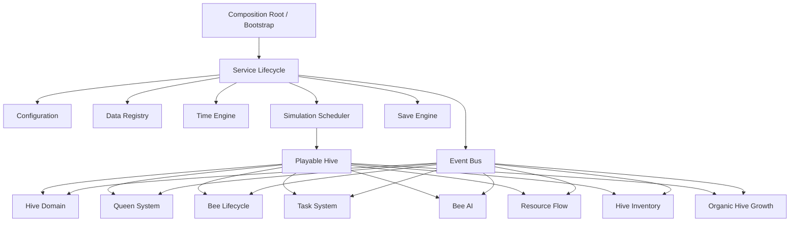

# EPIC 01 / EPIC 02 Integration

## Purpose

This document summarizes the current integrated architecture after `BEE-020 First Playable Hive`. The project now has a modular foundation capable of running a first colony loop without relying on the legacy prototype managers.

## System Map

## EPIC 01 Foundation

EPIC 01 established the runtime backbone:

* configuration loading, validation, and caching;
* service lifecycle orchestration;
* event bus and diagnostics;
* simulation time and scheduling;
* save/load engine;
* data registry;
* simulation engine context.

The infrastructure remains separate from gameplay logic. Services expose official APIs and can be tested without scene-specific behavior.

## EPIC 02 Colony Core

EPIC 02 introduced the playable colony domains:

* hive aggregate and validation;
* queen health, evolution, egg production, and events;
* bee lifecycle and roles;
* colony task queue and assignment;
* bee AI behavior framework;
* resource flow and transactions;
* physical hive inventory;
* organic hive growth topology;
* first playable hive bootstrap and diagnostics.

The colony is now represented as a superorganism: population, resources, tasks, queen production, inventory, and growth evolve together through official domain APIs.

## Integration Decisions

`BeeKingdom.Gameplay` assembles the domains but does not reference the concrete `BeeKingdom.Services` assembly. This avoids Unity assembly cycles and keeps service composition independent.

The first playable bootstrap uses configurable starter profiles:

* `StarterHiveProfile`
* `StarterPopulationProfile`
* `StarterResourceProfile`

These profiles should later be backed by data registry definitions or Unity assets, but the current C# representation keeps integration tests lightweight.

## Known Gaps

The project does not yet contain a dedicated Population Manager specification. Population is currently coordinated by `ColonySimulationController` using `HiveManager`, `BeeLifecycleManager`, and `BeeAIManager`.

The test runner compiles successfully in batch mode but does not currently emit NUnit XML results in this local Unity installation.

## Next Direction

The next bricks should move from the internal colony loop toward the external world: world generation, hex grid, flowers, water, seasons, weather, and resource regeneration.
