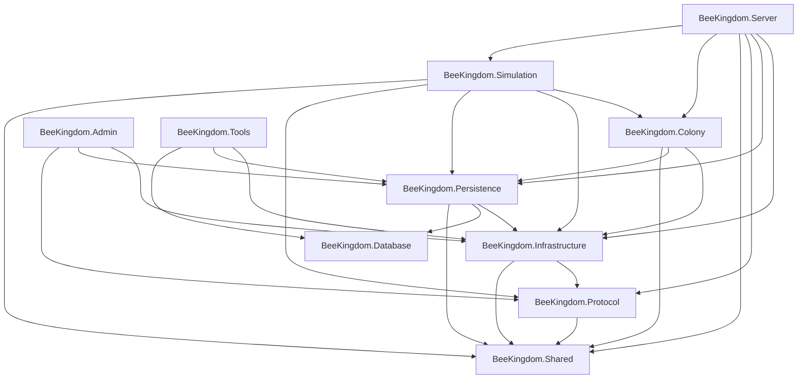

# Bee Kingdom Server Architecture

## Scope

`BeeKingdom.Server.slnx` introduces the backend foundation for Bee Kingdom MMO services. The server is authoritative: Unity remains a client, while durable state, protocol validation, persistence, administration, tooling, and future gameplay authority live in the server solution.

Bee Kingdom is independent from existing web projects. The previously inspected web solution only served to identify the kind of server environment already available: Windows/IIS with SQL Server nearby. Bee Kingdom owns its solution, runtime projects, database name, configuration keys, and schema.

## Solution Layout

```text
Server/
  BeeKingdom.Server.slnx
  src/
    BeeKingdom.Server
    BeeKingdom.Shared
    BeeKingdom.Protocol
    BeeKingdom.Persistence
    BeeKingdom.Database
    BeeKingdom.Infrastructure
    BeeKingdom.Authentication
    BeeKingdom.Accounts
    BeeKingdom.Gateway
    BeeKingdom.Colony
    BeeKingdom.Simulation
    BeeKingdom.Tools
    BeeKingdom.Admin
  tests/
    BeeKingdom.Tests
```

## Project Responsibilities

| Project | Responsibility |
| --- | --- |
| `BeeKingdom.Server` | Public server entry point, API startup, health, protocol ping, operational endpoints. No gameplay logic. |
| `BeeKingdom.Shared` | Unity/server-safe DTOs, identifiers, definitions, serialization helpers, value objects. No Unity dependency. |
| `BeeKingdom.Protocol` | Requests, responses, events, commands, notifications, versioned network envelope. |
| `BeeKingdom.Infrastructure` | Dependency injection extensions, options binding, logging-ready services, time provider, event bus, background workers. |
| `BeeKingdom.Authentication` | Identity, sessions, tokens, provider boundary, and security diagnostics. |
| `BeeKingdom.Accounts` | Account profile, preferences, settings, global progression, status, and account diagnostics. |
| `BeeKingdom.Gateway` | Client connection/session entry point, authentication bridge, protocol validation, rate limiting, and routing. |
| `BeeKingdom.Colony` | Authoritative colony data, lifecycle state, history, snapshots, high-level statistics, and colony diagnostics. No simulation logic. |
| `BeeKingdom.Simulation` | Authoritative tick engine, deterministic stage scheduler, loaded-colony orchestration, autosave checks, and simulation diagnostics. |
| `BeeKingdom.Persistence` | Repository and unit-of-work contracts, Bee Kingdom SQL Server options, migration runner boundary, backup boundary. |
| `BeeKingdom.Database` | Database script catalog and physical SQL scripts for the independent `BeeKingdom` database. |
| `BeeKingdom.Tools` | Internal command-line entry point for diagnostics and migration orchestration. |
| `BeeKingdom.Admin` | Administration and LiveOps entry point for server status and future player/colony/alliance management. |
| `BeeKingdom.Tests` | Unit and architecture tests for DI, protocol, shared serialization, and infrastructure contracts. |

## Shared Contracts Framework

`BeeKingdom.Shared` is the language boundary between Unity and the server. It contains no Unity, SQL, ASP.NET, networking, or server-service dependency.

```text
BeeKingdom.Shared/
  Commands
  Constants
  Contracts
  Definitions
  DTO
  Enums
  Events
  Extensions
  Messages
  Notifications
  Requests
  Responses
  Serialization
  Utilities
  ValueObjects
  Versioning
```

Core shared interfaces:

* `IContract`
* `ICommand`
* `IRequest`
* `IResponse`
* `IDomainEvent`
* `INotification`

All contracts carry `ContractVersion`. DTOs remain separate from internal gameplay models and represent transport-safe snapshots such as `PlayerDto`, `ColonyDto`, `BeeDto`, `BuildingDto`, `ChamberDto`, `ResourceDto`, `AllianceDto`, and `InventoryDto`.

Serialization is abstracted behind `IContractSerializer`. The current implementation uses `System.Text.Json` through `SystemTextJsonContractSerializer`, but no contract depends on a specific network protocol.

## Communication Protocol

`BeeKingdom.Protocol` defines the official transport-independent communication layer between Unity and the server. All future gateways should move `ProtocolMessage<TPayload>` instances rather than inventing transport-specific envelopes.

The protocol provides:

* `ProtocolManager`
* `MessageSerializer`
* `MessageDeserializer`
* `ProtocolVersionManager`
* `ProtocolDiagnostics`
* `ProtocolValidator`
* `MessageRegistry`

Each message includes protocol version, message id, message type, correlation id, trace id, UTC timestamp, session id, player id, colony id, and payload. Supported message categories include request, response, command, event, notification, heartbeat, acknowledgement, and error.

Detailed protocol documentation is in `Docs/Architecture/Protocol.md`.

## Authentication Service

`BeeKingdom.Authentication` is the platform identity entry point. It exposes `AuthenticationManager` and `IAuthenticationService` for login, refresh, token validation, token revocation, logout, global logout, and session lookup.

The service currently provides:

* email/password provider;
* provider extension interface for Google, Apple, Steam, Epic, and guest accounts;
* PBKDF2 password hashing;
* opaque token generation and hashed token storage;
* refresh token rotation;
* session validation and revocation;
* configurable lifetimes, max sessions, max attempts, and lockout duration;
* authentication diagnostics and security events.

## Account Service

`BeeKingdom.Accounts` owns permanent player identity data. It provides `AccountManager` and `IAccountService` for account creation, lookup, profile updates, preference updates, suspension, reactivation, deletion, and query.

The service manages account profile, settings, preferences, global progression, account status transitions, diagnostics, and account events. It does not manage colony or gameplay simulation data.

## Gateway Server

`BeeKingdom.Gateway` is the single logical entry point for clients. It provides `GatewayManager`, `GatewayHost`, `ConnectionManager`, `SessionRouter`, `RequestRouter`, `GatewayRateLimiter`, and `GatewayDiagnostics`.

Gateway responsibilities:

* accept connections;
* authenticate sessions through `BeeKingdom.Authentication`;
* validate protocol messages;
* enforce configurable rate limits;
* route messages to service targets;
* disconnect invalid connections;
* expose gateway statistics.

The gateway is transport-independent and contains no gameplay logic.

## Colony Service

`BeeKingdom.Colony` is the source of truth for colony data. It provides `ColonyManager`, `ColonyService`, `ColonyRegistry`, `IColonyRepository`, `ColonySnapshot`, and `ColonyDiagnostics`.

The service manages colony creation, deletion, loading, saving, renaming, query, high-level statistics, history, validated status transitions, and versioned full or incremental snapshots. It intentionally contains no bee simulation, resource evolution, construction rules, combat, AI, or world progression logic.

Detailed colony documentation is in `Docs/Architecture/ColonyArchitecture.md`.

## Simulation Service

`BeeKingdom.Simulation` is the server-authoritative simulation core. It provides `SimulationManager`, `SimulationEngine`, `SimulationScheduler`, `TickProcessor`, `SimulationContext`, and `SimulationDiagnostics`.

The service executes fixed ticks through the strict gameplay phase order, supports pause/resume, administrative variable ticks, fast-forward for tests, colony loading/unloading, autosave checks through the Colony Service, and lifecycle events. It is the intended home for future gameplay systems such as construction, population, lifecycle, needs, health, AI, economy, and world updates.

Detailed simulation documentation is in `Docs/Architecture/SimulationArchitecture.md`.

## Planned Authority Contracts

The BEE-161 to BEE-180 backend analysis produced two follow-up SERVER specifications:

* `SERVER-009 - Authority Protocol Compatibility and Snapshot Contracts`
* `SERVER-010 - Server Handoff Command Routing and Recovery Contracts`
* `SERVER-011 - Prediction Reconciliation and Client Correction Contracts`
* `SERVER-012 - Authority Coverage Risk Governance and Closure Gates`
* `SERVER-013 - Persistence Foundation Contracts and Gates`
* `SERVER-014 - Data Governance and Long Run Persistence Contracts`
* `SERVER-015 - Persistence Lifecycle Retention and Handoff Governance`
* `SERVER-016 - Persistence Runtime Readiness Contracts and Evidence Gates`
* `SERVER-017 - Persistence Visual Verification Handoff and Evidence Alignment`

These specifications prepare future backend layers for protocol readiness, snapshot handoff, digest validation, delta sync, session authority, drift diagnostics, command routing, observation subscriptions, event journal, retry idempotency, recovery, load budgets, prediction, reconciliation, visual correction contracts, evidence bundles, risk registers, migration guards, readiness projections, closure gates, persistence boundaries, save migration manifests, snapshot schema registries, identity maps, compatibility matrices, retention policies, integrity checks, persistence failure catalogs, save/load evidence gates, data classification, migration dependency graphs, compaction policies, long-run storage budgets, audit trails, recovery plans, content registry links, lifecycle states, redaction requirements, sampling plans, persistence drift detection, governance reports, persistence handoff gates, runtime save/load boundary contracts, fixture catalogs, migration dry-run scenarios, snapshot verification harnesses, redaction previews, persistence observability hooks, demo read model contracts, regression suite contracts, backend persistence readiness matrices, runtime readiness gates, server analysis intake, blocker explanations, evidence drilldowns, runtime gap triage, backend handoff reviews, evidence alignment matrices, demo regression capture boundaries, milestone projections, and visual verification gates.

They are specifications only at this point. No runtime transport, SQL migration, Unity code, DEMO code, QA code, or gameplay implementation has been added for these lots yet.

## Dependency Direction



Gameplay rules are intentionally absent from the entry-point projects. Future server-authoritative simulation systems should be added behind interfaces and registered through composition extensions.

## Reused Conventions

The server mirrors the existing modular Bee Kingdom architecture:

* a single composition surface per executable;
* typed event bus as the communication boundary;
* configuration through named options and environment-specific settings;
* structured logging through `ILogger`;
* deterministic, dependency-directed services;
* no Unity dependency in shared/backend layers.

## Runtime Endpoints

Initial public server endpoints:

* `GET /health`
* `POST /protocol/ping`
* `GET /ops/migrations/pending`
* `POST /auth/login`
* `POST /auth/refresh`
* `POST /auth/validate`
* `POST /auth/logout`
* `POST /accounts`
* `GET /accounts/{accountId}`
* `POST /gateway/connections`
* `POST /gateway/connections/{connectionId}/authenticate`
* `POST /gateway/connections/{connectionId}/disconnect`
* `GET /gateway/statistics`
* `POST /colonies`
* `GET /colonies/{colonyId}`
* `POST /colonies/{colonyId}/load`
* `POST /colonies/{colonyId}/save`
* `POST /colonies/{colonyId}/rename`
* `POST /colonies/{colonyId}/status`
* `DELETE /colonies/{colonyId}`
* `GET /colonies/{colonyId}/statistics`
* `POST /simulation/start`
* `POST /simulation/stop`
* `POST /simulation/pause`
* `POST /simulation/resume`
* `POST /simulation/tick`
* `POST /simulation/fast-forward`
* `POST /simulation/colonies/{colonyId}/load`
* `POST /simulation/colonies/{colonyId}/unload`
* `GET /simulation/diagnostics`

Initial admin endpoints:

* `GET /admin/status`

## Server Host Profile

`BeeKingdomServerHostProfile` records the intended server environment without depending on another product:

* hosting model: IIS;
* target operating system: Windows Server 2025;
* SQL Server role: dedicated Bee Kingdom database.

## Persistence

The initial persistence layer defines repository and unit-of-work contracts plus SQL Server configuration for the independent `BeeKingdom` database. Physical scripts are stored in `BeeKingdom.Database/Scripts`, and `DatabaseCatalog` exposes the first migration list to tools and operational endpoints.

The current unit of work is a no-op placeholder so the architecture compiles before choosing a concrete SQL access library. Replacing it with a SQL-backed implementation is the next persistence milestone.

## Deployment Notes

The Bee Kingdom server projects target `.NET 8` for the new backend code and are structured for deployment on Windows Server 2025 with IIS and SQL Server. The database is independent and named `BeeKingdom`.
