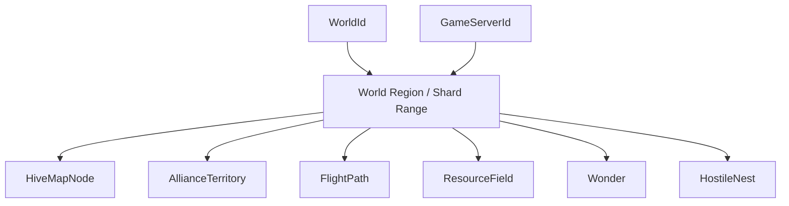

# Bee Kingdom World MMO Server Model

## Statut

Document prepare par Server-B pour un modele serveur futur. Il ne remplace pas Server-A, ne publie rien, ne cree aucun endpoint live, ne modifie aucune migration SQL et ne change pas le serveur de production.

Le but est de definir le modele logique de carte monde MMO avant implementation runtime.

## Objectifs

* etablir les identifiants `WorldId` et `GameServerId`;
* definir les entites futures de carte monde;
* fixer les regles de separation par monde et shard;
* preparer un contrat read-only non-live pour afficher une carte;
* documenter les risques serveur avant activation.

## Identifiants

### WorldId

`WorldId` identifie un monde MMO logique. Il est deja present sur les colonies sous forme de `Guid`; le modele futur doit le promouvoir en identifiant de domaine explicite, compatible avec les contrats partages.

Proposition future:

```csharp
public readonly record struct WorldId(Guid Value);
```

Regles:

* un joueur peut avoir une ou plusieurs colonies, mais chaque colonie active appartient a un seul `WorldId`;
* toutes les entites de carte monde doivent porter `WorldId`;
* les requetes de carte ne doivent jamais agreger plusieurs mondes dans une seule reponse;
* `WorldId` est une frontiere de securite, de persistence, de cache, de matchmaking, de guerre et de classement;
* toute migration entre mondes doit etre une operation administrative explicite, journalisee, non implicite.

### GameServerId

`GameServerId` identifie une instance serveur logique ou un shard d'execution capable de servir une portion d'un monde.

Proposition future:

```csharp
public readonly record struct GameServerId(Guid Value);
```

Regles:

* `GameServerId` n'est pas une identite gameplay exposee au joueur;
* un `WorldId` peut etre servi par un ou plusieurs `GameServerId`;
* un `GameServerId` ne doit jamais modifier des donnees hors des partitions qui lui sont assignees;
* les caches, locks, jobs, ticks et projections doivent etre scopes par couple `(WorldId, GameServerId)`;
* une reaffectation de shard doit passer par une phase de drain, snapshot, verification et reprise.

## Capacite par monde logique

ARCH-165 fixe la capacite officielle par serveur de jeu logique. Dans Bee Kingdom, un serveur joueur signifie un monde logique / `GameServerId`, pas une machine physique.

Contraintes de conception:

* 800 a 1 500 comptes crees par monde logique;
* 300 a 600 joueurs actifs estimes;
* 100 a 300 joueurs tres actifs quotidiens;
* maximum 100 joueurs par alliance;
* statuts de monde exposes par le registre: `Open`, `Full`, `Locked`, `Maintenance`, `Preparing`;
* les indicateurs `serverRecommended` et `serverFull` sont des champs read-only de registre, pas des commandes de selection ou de routage.

Le endpoint public `/runtime/world-registry-readiness` expose ces donnees comme readiness read-only non-live. Les compteurs de comptes, joueurs actifs, joueurs tres actifs quotidiens et alliances restent nullables tant qu'aucune source SQL/projection live n'est autorisee. Une reponse locale ou mock doit conserver `nonLive=true`, `readOnly=true` et `mockReadiness=true` pour ne pas creer de claim officiel de population, progression, sauvegarde ou synchronisation.

Le registre peut aussi exposer une liste configuree de mondes via `WorldRegistryReadiness:Worlds`. Cette liste reste une declaration de readiness, pas un routage production. Chaque entree peut porter `WorldId`, `GameServerId`, `DisplayName`, `Status`, `Region`, `Locale`, `ServerRecommended` et `ServerFull`, avec compteurs nullables. Le serveur bloque les statuts inconnus, les doublons de `WorldId`, les mondes a la fois complets et recommandes, et les configurations avec plusieurs mondes recommandes.

## Modele logique



Un monde est decoupe en regions logiques. Une region peut etre assignee a un serveur de jeu. Les entites de carte appartiennent toujours a un monde et a une position ou zone stable dans ce monde.

## Entites futures

### HiveMapNode

Noeud de ruche visible sur la carte monde.

Champs proposes:

| Champ | Type logique | Notes |
| --- | --- | --- |
| `NodeId` | Guid | Identifiant stable du noeud de carte. |
| `WorldId` | WorldId | Frontiere obligatoire. |
| `OwnerColonyId` | ColonyId | Colonie proprietaire. |
| `OwnerPlayerId` | PlayerId | Projection denormalisee pour lecture. |
| `AllianceId` | AllianceId? | Optionnel, projection non source de verite. |
| `Position` | WorldCoordinate | Coordonnees serveur. |
| `VisibilityState` | enum | Public, scouted, hidden, protected. |
| `PowerBand` | int | Tranche approximative, pas score complet si sensible. |
| `ShieldUntilUtc` | DateTimeOffset? | Projection read-only. |
| `Revision` | long | Version de projection. |

Regles:

* le noeud ne doit pas contenir de details internes de colonie;
* les informations militaires sensibles doivent etre degradees ou masquees;
* la position est serveur-authoritative.

### AllianceTerritory

Zone de controle revendiquee par une alliance.

Champs proposes:

| Champ | Type logique | Notes |
| --- | --- | --- |
| `TerritoryId` | Guid | Identifiant stable. |
| `WorldId` | WorldId | Frontiere obligatoire. |
| `AllianceId` | AllianceId | Proprietaire courant. |
| `Boundary` | HexSet ou Polygon | Zone logique, pas geographie cliente libre. |
| `ClaimState` | enum | Neutral, claimed, contested, locked, decaying. |
| `InfluenceScore` | int | Score serveur calcule. |
| `ContestedByAllianceIds` | AllianceId[] | Projection limitee. |
| `ValidFromUtc` | DateTimeOffset | Debut de validite. |
| `Revision` | long | Version de projection. |

Regles:

* le territoire ne doit pas etre modifie par le client;
* les conflits de revendication doivent etre resolus par le serveur;
* les frontieres doivent etre deterministes pour eviter les divergences entre clients.

### FlightPath

Trajet serveur entre deux points de carte.

Champs proposes:

| Champ | Type logique | Notes |
| --- | --- | --- |
| `FlightPathId` | Guid | Identifiant stable ou derive. |
| `WorldId` | WorldId | Frontiere obligatoire. |
| `OriginNodeId` | Guid? | Noeud source optionnel. |
| `DestinationNodeId` | Guid? | Noeud cible optionnel. |
| `OriginPosition` | WorldCoordinate | Source effective. |
| `DestinationPosition` | WorldCoordinate | Cible effective. |
| `PathKind` | enum | Scout, gather, reinforce, attack, trade, return. |
| `EstimatedDurationSeconds` | int | Projection non autoritaire pour affichage. |
| `VisibilityState` | enum | Hidden, own, alliance, public. |
| `Revision` | long | Version de projection. |

Regles:

* une carte read-only peut afficher des chemins visibles, mais pas les intentions cachees;
* les chemins d'attaque ou de guerre doivent respecter les regles de brouillard, alliance et droits d'observation;
* le contrat d'affichage ne doit pas accepter de commande de lancement de vol.

### ResourceField

Champ de ressources exploitable sur la carte.

Champs proposes:

| Champ | Type logique | Notes |
| --- | --- | --- |
| `ResourceFieldId` | Guid | Identifiant stable. |
| `WorldId` | WorldId | Frontiere obligatoire. |
| `Position` | WorldCoordinate | Centre ou ancrage. |
| `ResourceKind` | enum | Pollen, nectar, wax, propolis, royal_jelly, etc. |
| `RichnessBand` | int | Bande de richesse, pas valeur interne complete. |
| `OccupancyState` | enum | Free, occupied, contested, depleted, regenerating. |
| `OwnerColonyId` | ColonyId? | Occupant actuel si visible. |
| `RegeneratesAtUtc` | DateTimeOffset? | Projection si connue. |
| `Revision` | long | Version de projection. |

Regles:

* les quantites exactes peuvent rester serveur-only;
* les champs doivent etre lies au shard par position;
* la regeneration doit etre tickee par le serveur proprietaire du shard.

### Wonder

Objectif majeur ou monument de carte.

Champs proposes:

| Champ | Type logique | Notes |
| --- | --- | --- |
| `WonderId` | Guid | Identifiant stable. |
| `WorldId` | WorldId | Frontiere obligatoire. |
| `Position` | WorldCoordinate | Position serveur. |
| `WonderKind` | enum | AncientTree, RoyalBloom, Sunstone, etc. |
| `ControlState` | enum | Dormant, active, captured, contested, locked. |
| `ControllerAllianceId` | AllianceId? | Alliance controleuse si visible. |
| `NextWindowUtc` | DateTimeOffset? | Fenetre d'activite. |
| `PublicBuffSummary` | string? | Resume non sensible. |
| `Revision` | long | Version de projection. |

Regles:

* les merveilles peuvent devenir des hotspots de charge;
* les fenetres d'activite doivent etre planifiees pour eviter les pics globaux;
* les bonus exacts et conditions secretes peuvent rester serveur-only.

### HostileNest

Nid hostile PvE ou menace monde.

Champs proposes:

| Champ | Type logique | Notes |
| --- | --- | --- |
| `HostileNestId` | Guid | Identifiant stable. |
| `WorldId` | WorldId | Frontiere obligatoire. |
| `Position` | WorldCoordinate | Position serveur. |
| `HostileKind` | enum | WaspNest, HornetDen, ParasiteBloom, etc. |
| `ThreatBand` | int | Niveau approximatif. |
| `LifecycleState` | enum | Dormant, active, enraged, defeated, respawning. |
| `TargetTerritoryId` | Guid? | Territoire menace si visible. |
| `RespawnsAtUtc` | DateTimeOffset? | Projection si connue. |
| `Revision` | long | Version de projection. |

Regles:

* le comportement hostile est serveur-authoritative;
* les cibles et timings sensibles peuvent etre partiellement masques;
* les evenements de nid doivent etre idempotents et journalises.

## Types communs

```csharp
public readonly record struct WorldCoordinate(int X, int Y);

public sealed record WorldShardKey(
    WorldId WorldId,
    GameServerId GameServerId,
    string RegionKey);

public sealed record WorldEntityVersion(
    long Revision,
    DateTimeOffset UpdatedAtUtc);
```

Regles:

* les coordonnees client ne sont jamais acceptees comme source de verite;
* `RegionKey` doit etre derivee cote serveur a partir de `WorldId` et de la position;
* chaque projection visible porte une revision monotone par monde ou par region.

## Separation par monde et shard

1. Toute table future de carte monde doit inclure `WorldId`.
2. Toute table ou file de traitement shardee doit inclure `WorldId` et une cle de region ou shard.
3. Toute lecture de carte doit filtrer par un seul `WorldId`.
4. Toute ecriture future doit verifier que l'acteur, la colonie, l'alliance, la cible et l'entite appartiennent au meme `WorldId`.
5. Les alliances ne doivent pas posseder de territoire dans plusieurs mondes, sauf modele explicitement cross-world et separe.
6. Les guerres, rallies, renforts et chemins de vol ne traversent pas les mondes.
7. Les classements et scores doivent etre scopes par `WorldId`.
8. Les caches doivent etre namespaced par `WorldId` puis par region.
9. Les jobs de simulation doivent prendre un lock par `(WorldId, RegionKey)` ou par partition equivalente.
10. Les snapshots exportes doivent indiquer `WorldId`, `RegionKey`, `ProjectionRevision` et `GeneratedAtUtc`.

## Contrat read-only non-live pour afficher une carte

Ce contrat est une specification future. Il ne correspond a aucun endpoint actif.

Nom logique:

```text
WorldMapReadModelQuery
```

Usage:

* afficher une carte a partir d'une projection serveur;
* supporter un client Unity, un outil admin ou une page de revue;
* ne jamais executer de commande;
* ne jamais modifier un noeud, un territoire, un vol, une ressource, une merveille ou un nid hostile.

Requete future:

```json
{
  "contractVersion": "1.0",
  "requestId": "00000000-0000-0000-0000-000000000000",
  "createdAtUtc": "2026-07-11T00:00:00Z",
  "worldId": "00000000-0000-0000-0000-000000000000",
  "viewerPlayerId": "00000000-0000-0000-0000-000000000000",
  "viewerColonyId": "00000000-0000-0000-0000-000000000000",
  "viewport": {
    "minX": -100,
    "minY": -100,
    "maxX": 100,
    "maxY": 100
  },
  "detailLevel": "Summary",
  "knownRevision": 0
}
```

Reponse future:

```json
{
  "contractVersion": "1.0",
  "worldId": "00000000-0000-0000-0000-000000000000",
  "projectionRevision": 12345,
  "generatedAtUtc": "2026-07-11T00:00:00Z",
  "isLive": false,
  "stalenessSeconds": 30,
  "viewport": {
    "minX": -100,
    "minY": -100,
    "maxX": 100,
    "maxY": 100
  },
  "hiveNodes": [],
  "allianceTerritories": [],
  "flightPaths": [],
  "resourceFields": [],
  "wonders": [],
  "hostileNests": [],
  "redactions": []
}
```

Garanties:

* read-only strict;
* reponse non-live issue d'une projection ou d'un snapshot;
* aucune promesse de temps reel;
* pagination ou fenetrage obligatoire pour grandes cartes;
* donnees sensibles masquees selon le viewer;
* aucun champ de commande, action, reservation ou mutation;
* `isLive` doit rester `false` tant que ce contrat sert a l'affichage non-live;
* le client doit accepter que la projection soit stale.

Non-objectifs:

* pas de lancement de vol;
* pas de claim de territoire;
* pas de recolte;
* pas d'attaque;
* pas de scouting actif;
* pas de chat alliance;
* pas de websocket live;
* pas d'endpoint REST actif;
* pas de migration SQL dans cette preparation.

## Gouvernance des donnees sensibles

| Donnee | Visibilite recommandee |
| --- | --- |
| Position de ruche ennemie non decouverte | Masquee ou approximee. |
| Trajet d'attaque entrant | Visible seulement selon droits, detection et timing serveur. |
| Puissance militaire exacte | Jamais dans le read model public. |
| Quantite exacte d'un champ ressource | Masquee par bande. |
| Bonus secret d'une merveille | Serveur-only. |
| Cibles futures d'un nid hostile | Masquees si non revelees. |
| Composition d'alliance en guerre | Projection reduite. |

## Risques serveur

### Charge

Risques:

* carte monde tres consultee par zoom, pan et refresh;
* hotspots autour des merveilles, guerres et nids hostiles;
* cout eleve des intersections de territoires et viewports;
* rafraichissements clients synchronises apres evenement mondial.

Mitigations:

* projections pre-calculees par region;
* fenetrage obligatoire;
* detail levels stricts;
* cache par `(WorldId, RegionKey, DetailLevel, VisibilityBucket)`;
* limites de frequence cote gateway;
* invalidation par revision plutot que recalcul global.

### Sharding

Risques:

* entites proches d'une frontiere de shard;
* vols traversant plusieurs regions;
* reassignment d'un shard pendant une guerre;
* locks distribues trop larges.

Mitigations:

* proprietaire serveur unique par region;
* protocole de handoff: drain, snapshot, verify, activate;
* evenements idempotents avec revision;
* lectures cross-region via projections, pas via mutation directe;
* tests de frontiere et de migration avant activation.

### Alliances

Risques:

* alliance presente sur plusieurs regions;
* permissions de lecture differentes entre membres;
* abus d'information via comptes secondaires;
* depart ou expulsion pendant une action monde.

Mitigations:

* permissions resolues au moment de generer la projection;
* journal d'appartenance alliance;
* snapshots de droits pour actions longues;
* redaction forte des informations militaires.

### Territoires

Risques:

* chevauchements de claims;
* calculs d'influence non deterministes;
* frontieres client divergentes;
* contention elevee sur zones contestees.

Mitigations:

* geometrie serveur discrete ou polygonale canonique;
* resolution par tick et revision;
* source de verite unique par region;
* contrats de lecture separes des commandes de claim.

### Donnees de guerre

Risques:

* fuite de trajectoires, horaires, cibles et puissance;
* replay de projections obsoletes;
* observation non autorisee apres changement d'alliance;
* incoherence entre combat, carte et notifications.

Mitigations:

* niveaux de visibility explicites;
* expiration courte des projections sensibles;
* verification de droits par viewer;
* event journal serveur pour guerre et carte;
* redaction systematique des champs non necessaires a l'affichage.

### Synchronisation

Risques:

* clients affichant des revisions differentes;
* latence entre simulation, persistence et projection;
* ordre d'evenements divergent entre regions;
* conflits lors du passage read model vers live model.

Mitigations:

* `projectionRevision` monotone;
* `generatedAtUtc` et `stalenessSeconds` obligatoires;
* idempotence par evenement;
* compatibilite de contrat versionnee;
* separation explicite entre read-only projection et runtime commands.

## Gates avant implementation

Avant tout endpoint live ou migration:

1. valider les identifiants `WorldId` et `GameServerId` dans `BeeKingdom.Shared`;
2. valider la strategie de sharding et de regions;
3. definir le schema SQL separe pour projections de carte;
4. definir les droits de visibility par viewer;
5. produire des fixtures de carte non-live;
6. tester les redactions de donnees sensibles;
7. tester les limites de viewport, pagination et cache;
8. faire valider les commandes futures separement du read model;
9. documenter le rollback et le handoff de shard;
10. obtenir validation architecte avant activation serveur.

## Decision Server-B

Server-B prepare uniquement le modele et le contrat futur. La prochaine etape sure est une revue d'architecture avec Server-A pour decider ou placer les value objects, les DTOs et les projections quand l'implementation sera autorisee.
